# ROS2模型搭建

## ROS2在Ubuntu下安装

1、配置ROS2的apt源

```c
sudo apt update && sudo apt install curl gnupg lsb-release
```

安装成功如下：

<div align=center>
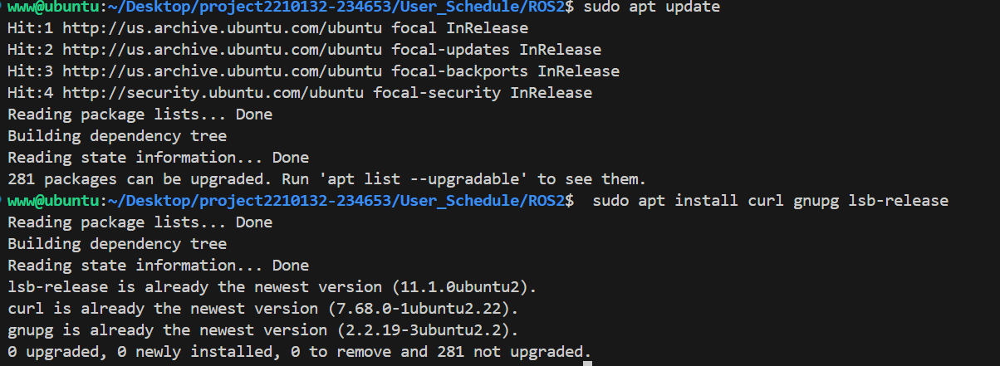
</div>

2、下载 ROS GPG 公钥并保存在指定文件

```c
sudo curl -sSL https://raw.githubusercontent.com/ros/rosdistro/master/ros.key -o /usr/s
```

3、将 ROS 的软件源添加到 APT 源列表中。使用 `echo` 命令添加一行到 `/etc/apt/sources.list.d/` 目录下

```c
echo "deb [arch=$(dpkg --print-architecture) signed-by=/usr/share/keyrings/ros-archive-keyring.gpg] http://packages.ros.org/ros/ubuntu $(lsb_release -sc) main" | sudo tee /etc/apt/sources.list.d/ros-latest.list
```

安装成功如下：

<div align=center>
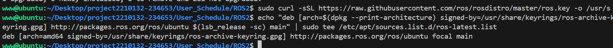
</div>

4、更新apt索引

```c
sudo apt update
```

报错如下：

<div align=center>
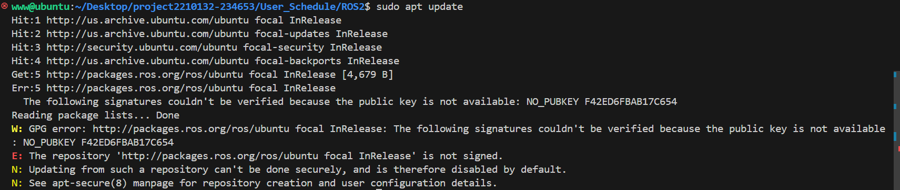
</div>

无法验证 ROS 软件包仓库的公钥，是因为系统中缺少用于验证仓库签名的公钥。缺少NO_PUBKEY F42ED6FBAB17C654，需要下载并添加 ROS 的 GPG 公钥中。

```c
sudo gpg --keyserver keyserver.ubuntu.com --recv-keys F42ED6FBAB17C654 //下载公钥
sudo gpg --export -a F42ED6FBAB17C654 | sudo tee /usr/share/keyrings/ros-archive-keyring.gpg > /dev/null
 //导出公钥到APT
```

安装成功如下：

<div align=center>
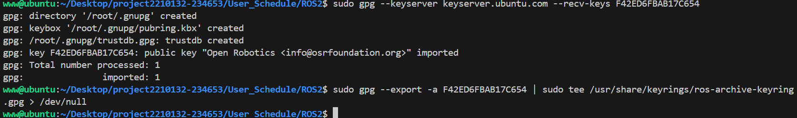
</div>
5、更新软件包列表确认新的 GPG 公钥已经生效

```c
sudo apt update
```

仍然报错缺少NO_PUBKEY F42ED6FBAB17C654

<div align=center>
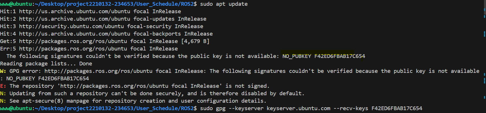
</div>

手动添加公钥到 `/etc/apt/trusted.gpg.d/`

```c
curl -sSL https://raw.githubusercontent.com/ros/rosdistro/master/ros.asc | gpg --dearmor -o ros-archive-keyring.gpg
```

```c
sudo mv ros-archive-keyring.gpg /etc/apt/trusted.gpg.d/
```

确认密钥已经正确添加到受信任的密钥列表中，可以看到`F42ED6FBAB17C654`公钥添加成功

```c
sudo apt-key list
```

<div align=center>
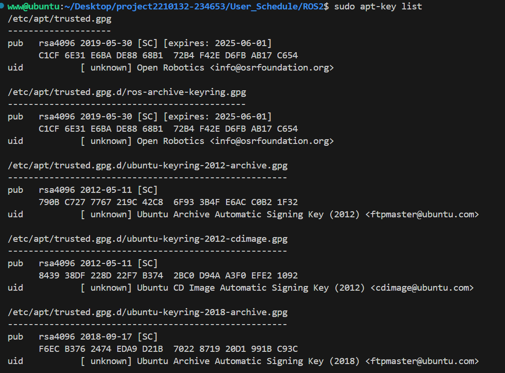
</div>

查看`/etc/apt/sources.list.d/ros-latest.list` 文件内容是否正确

```
echo "deb [arch=amd64] http://packages.ros.org/ros/ubuntu $(lsb_release -sc) main" | sudo tee /etc/apt/sources.list.d/ros-latest.list
```

<div align=center>
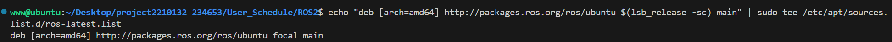
</div>

内容不正确，修改内容

```c
 echo "deb [arch=amd64 signed-by=/usr/share/keyrings/ros-archive-keyring.gpg] http://packages.ros.org/ros2/ubuntu $(lsb_release -sc) main" | sudo tee /etc/apt/sources.list.d/ros-latest.list
```

<div align=center>
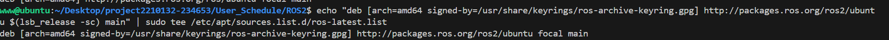
</div>

查看 GPG 公钥位于 `/usr/share/keyrings/ros-archive-keyring.gpg`

```c
ls -l /usr/share/keyrings/ros-archive-keyring.gpg
```

<div align=center>
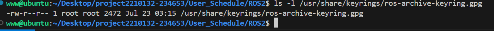
</div>

修复依赖关系

```c
sudo apt --fix-broken install
```

<div align=center>
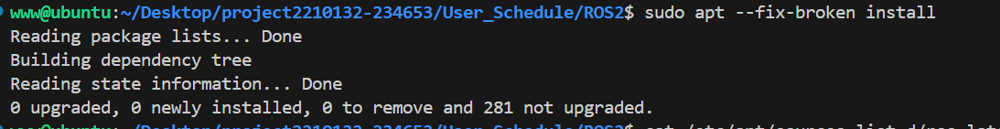
</div>

6、使⽤apt安装完整的ROS2

```c
sudo apt install ros-galactic-desktop
```

安装成功如下：

<div align=center>
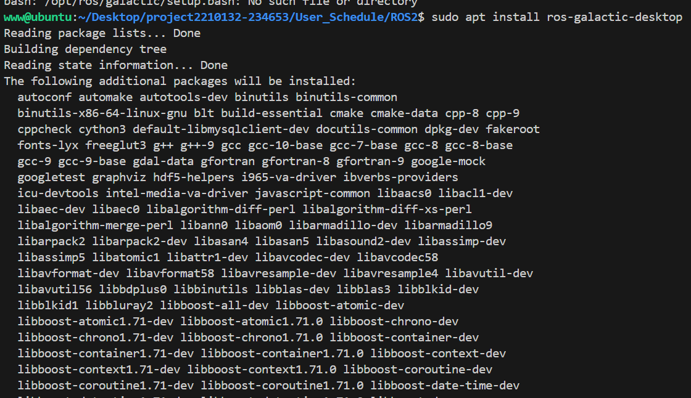
</div>


安装完成后，在~/.bashrc⽂件中添加ros2的环境变量:

```c
echo "source /opt/ros/galactic/setup.bash" >> ~/.bashrc
```

7、rosdep 是ROS 2用于安装依赖项的工具。首先安装 `python3-rosdep`

```c
sudo apt install python3-rosdep
```

安装成功如下：

<div align=center>
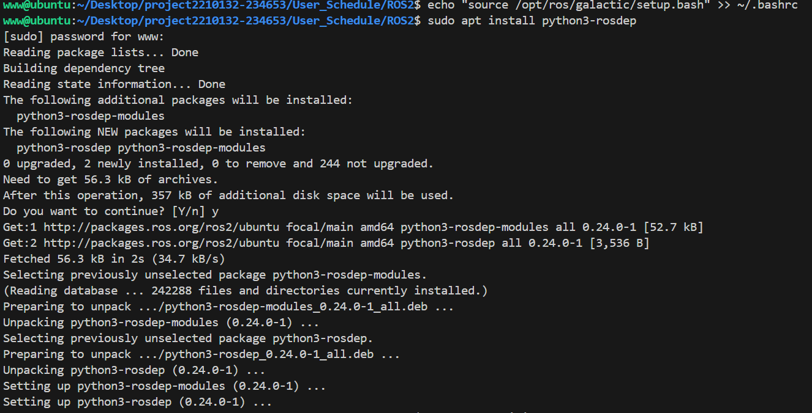
</div>

初始化rosdep

```c
sudo rosdep init
```

报错如下：

<div align=center>
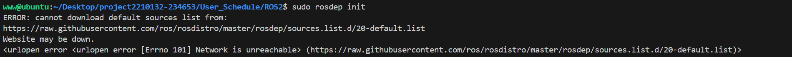
</div>

 `ping google.com`不成功，判定网络问题，重新测试或者重启。

```c
rosdep update
```

成功截图：

<div align=center>
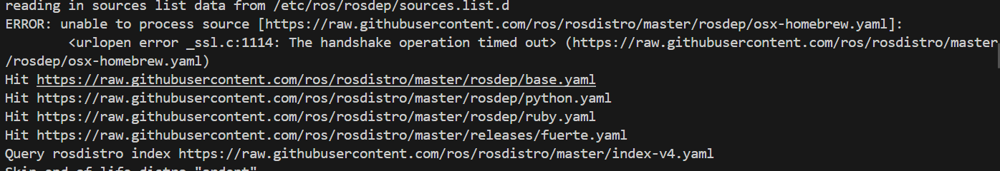
</div>

或者网络问题无法解决则手动添加默认源列表，方法如下：

```c
sudo mkdir -p /etc/ros/rosdep/sources.list.d//创建目录
```

```c
echo "yaml https://raw.githubusercontent.com/ros/rosdistro/master/rosdep/osx-homebrew.yaml osx" | sudo tee /etc/ros/rosdep/sources.list.d/00-homebrew.list
echo "yaml https://raw.githubusercontent.com/ros/rosdistro/master/rosdep/base.yaml" | sudo tee /etc/ros/rosdep/sources.list.d/20-default.list
echo "yaml https://raw.githubusercontent.com/ros/rosdistro/master/rosdep/python.yaml" | sudo tee /etc/ros/rosdep/sources.list.d/21-python.list
echo "yaml https://raw.githubusercontent.com/ros/rosdistro/master/rosdep/ruby.yaml" | sudo tee /etc/ros/rosdep/sources.list.d/22-ruby.list
```

8、测试

打开一个终端，依次执行以下命令，运行 talker 节点，另开一个终端，依次执行以下命令，运行 listener 节点，看到 talker 说它正在发布消息，而 listener 说我听到了这些消息，完成基础环境搭建。

```c
ros2 run demo_nodes_py listener
ros2 run demo_nodes_cpp talker
```

<div align=center>
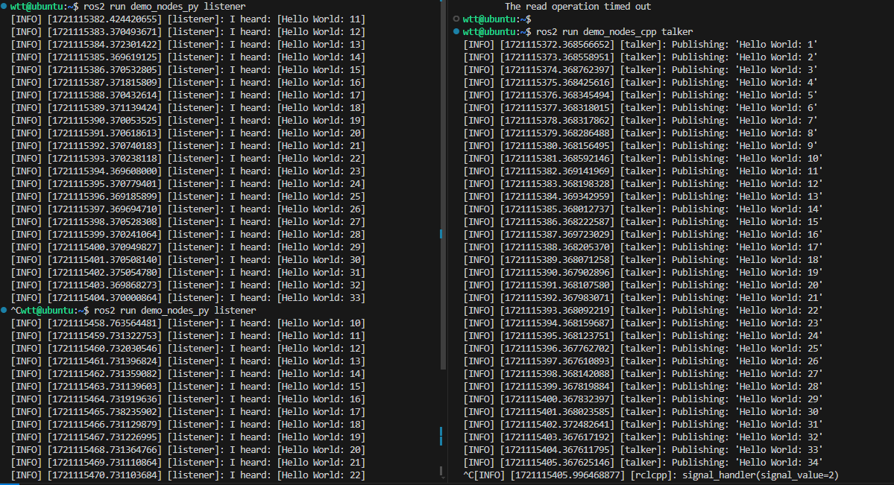
</div>


## 程序部署

依赖安装

```c
sudo apt install ros-galactic-rclcpp//rclcpp库
sudo apt install python3-colcon-common-extensions
```

设置并初始化一个ROS 2工作空间

```c
mkdir -p ~/ros2_ws/src 
cd ~/ros2_ws
```

在工作空间的 `src` 目录中创建一个新的ROS 2包来包含用户态线程调度程序

```c
ros2 pkg create --build-type ament_cmake user_thread_scheduler
```

确保 `libtask.a` 文件位于 `~/user_thread_scheduler` 目录中。如果生成的文件不在这个位置，需要将其移动

编写CMakeLists.txt文件定义构建ROS 2包的规则、package.xml中定义报的元数据和依赖项

<div align=center>
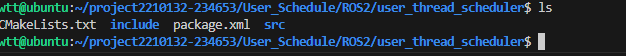
</div>

编写main.cpp作为ROS 2节点的入口，负责加载内核模块并运行用户态调度程序

在ROS 2工作空间中使用colcon构建项目

```
cd ~/ros2_ws
colcon build
```

<div align=center>
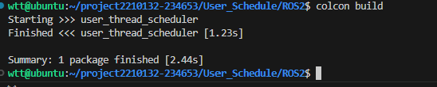
</div>

插入内核模块

```c
 sudo insmod signal.ko
```

运行ROS 2节点，查看输出是否正常

```c
ros2 run user_thread_scheduler thread_scheduler
```

运行结果如下：

<div align=center>
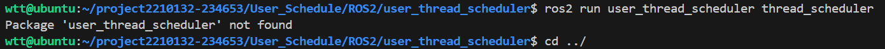
</div>

```c
ros2 pkg list | grep user_thread_scheduler
```

查看构建的包是否存在，不存在则构建失败，清理并重新完成构建

```c
rm -rf build install log
colcon build
```

构建完成，环境变量需要设置

```c
source install/setup.bash
```

重新查看构建是否成功，并运行

<div align=center>
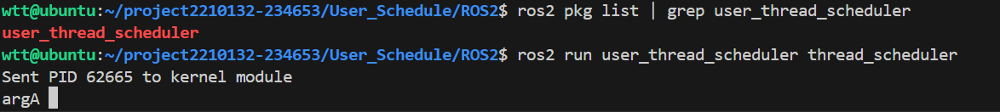
</div>

查看ROS 2日志，确保节点启动并运行没有错误信息

```c
tail -f ~/.ros/log/latest/rosout.log
```

确保内核模块已成功加载

```c
dmesg | grep signal
```


注：main.cpp、CMakeLists.txt、 package.xml代码实现部分见~User_Schedule/ROS2/user_thread_scheduler/