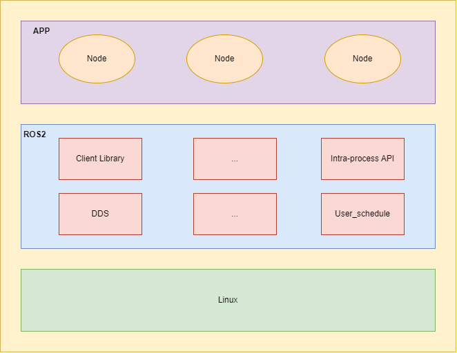
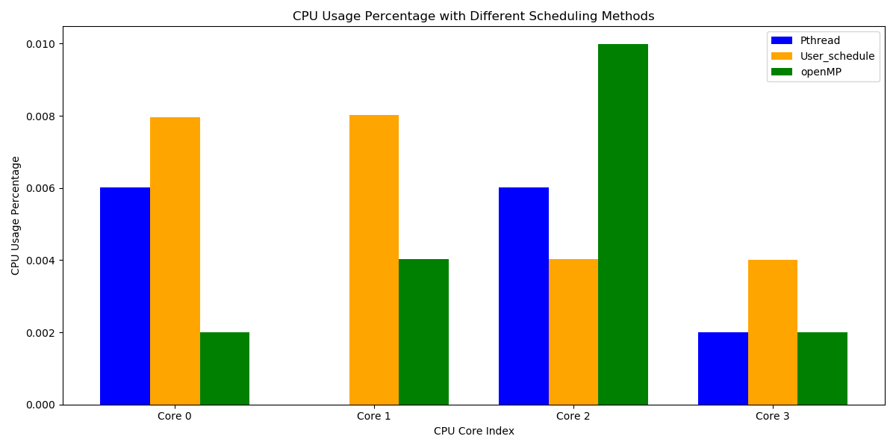
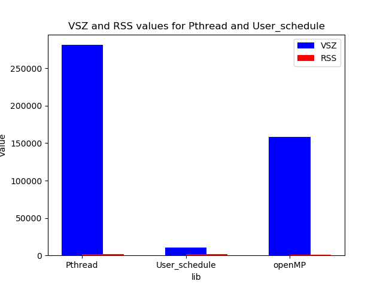
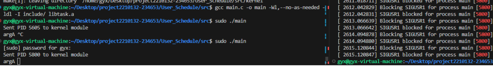
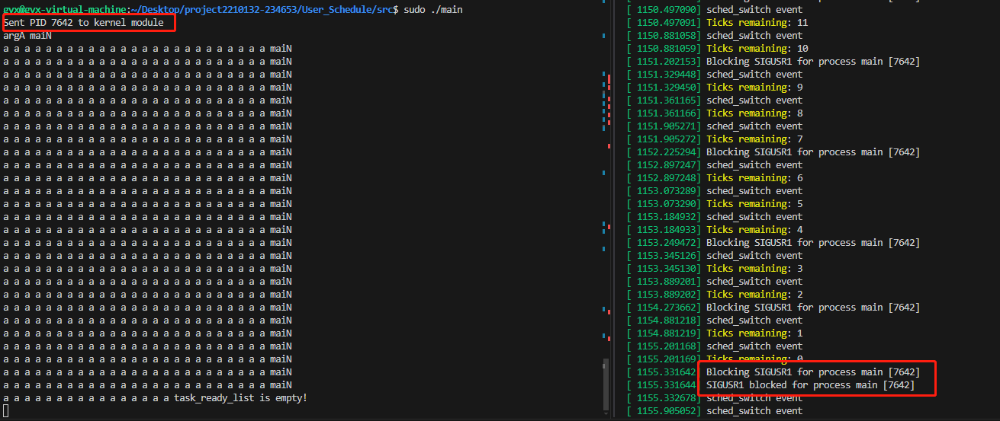

`

[TOC]

## 1. 项目简介

### 1.1 概述

在海量的数据处理场景下，为了提高并行处理计算能力，采用分治思想，将一个大的计算模型分解成多个小的计算任务。在原生Linux中使用Linux线程来执行多个小的计算任务，由于原生Linux线程的调度是由Linux内核决定的，频繁的线程切换会带来显著的性能开销。为了减少用户态和内核态的频繁切换，故提出User_schedule(用户态抢占式任务调度框架)，旨在让多个小任务尽可能在一个进程（单线程进程）内执行，内核态完成任务计数并阻塞信号集，任务调度在用户态进行，减少不必要的线程切换，提高并行计算效率。

目前本项目所提出的User_schedule(用户态调度框架)已经应用在 ROS2 框架上，并作为 ROS2 体系结构的一个组件部分，提供 User_schedule 的接口，在 ROS2 框架上进行调度运行。

### 1.2 项目成员

**校内指导老师**：陈莉君、谢瑞莲

**校外指导老师**：任玉鑫、吴一凡

**项目成员**：

| 姓名   | 年级 | 专业     |
| ------ | ---- | -------- |
| 高怡香 | 研一 | 计算机科学与技术 |
| 王月妮 | 研一 | 电子信息 |
| 刘冰   | 研二 | 电子信息 |

### 1.3 项目架构

项目的整体架构图如下所示：



### 1.4 仓库目录结构

```sh
project2210132-234653
./
├── Docs 设计及使用文档
│   ├── images
│   ├── ROS2模型搭建.md
│   ├── User_schedule工具使用指南.md
│   ├── 会议记录.md
│   ├── 技术方案.md
│   ├── 技术调研.md
│   └── 阶段性技术报告.md
├── README.md
├── References 参考文献及阅读笔记
│   ├── Callisto  Co-scheduling parallel runtime systems.pdf
│   ├── FJOS.pdf
│   ├── ghost.pdf
│   ├── images
│   ├── learning_docs
│   │   ├── images
│   │   └── openMP
│   │       ├── examples
│   │       │   ├── for.c
│   │       │   ├── for.trace
│   │       │   ├── norm_for.c
│   │       │   ├── norm_for.trace
│   │       │   ├── norm_section.c
│   │       │   ├── openMP基础学习.md
│   │       │   ├── section.c
│   │       │   ├── simd.cpp
│   │       │   └── 是否使用openMP的程序的差别.md
│   │       └── README.md
│   ├── NuPoCo_最大限度地利用系统利用并行管理的共定位并行应用程序.pdf
│   ├── Optimization.pdf
│   ├── Parcae A System for Flexible Parallel Execution.pdf
│   ├── ppOpen-AT动态确定线程数.pdf
│   ├── readNotes
│   │   ├── CallistoNote.md
│   │   ├── ForkJoin并行的实用、可预测和高效的系统支持.md
│   │   ├── ghost_readNote.md
│   │   ├── ROS2.md
│   │   ├── SyrupNote.md
│   │   ├── Thread Reinforcer_动态确定线程数.md
│   │   ├── 多线程数据流软件的优化.md
│   │   ├── 最大限度地利用系统利用并行管理的共定位并行应用程序.md
│   │   └── 通过使用ppOpen-AT改变OpenMP中的指令和线程数进行自动调优.md
│   ├── ROS2多线程执行器上DAG任务的优先级分配方法_纪东.pdf
│   ├── syrup.pdf
│   └── Thread_reinforcer.pdf
└── User_Schedule 项目实现
    ├── ROS2
    │   └── user_thread_scheduler
    │       └── src
    │           ├── build
    │           ├── CMakeLists.txt
    │           ├── device
    │           │   ├── console.c
    │           │   └── ioqueue.c
    │           ├── hook.c
    │           ├── include
    │           │   ├── analog_interrupt.h
    │           │   ├── assert.h
    │           │   ├── bitmap.h
    │           │   ├── console.h
    │           │   ├── debug.h
    │           │   ├── init.h
    │           │   ├── ioqueue.h
    │           │   ├── list.h
    │           │   ├── set_ticker.h
    │           │   ├── stdint.h
    │           │   ├── sync.h
    │           │   ├── task.h
    │           │   └── timer.h
    │           ├── interrupt
    │           │   ├── analog_interrupt.c
    │           │   └── timer.c
    │           ├── kernel
    │           │   ├── Makefile
    │           │   └── signal.c
    │           ├── lib
    │           │   ├── assert.c
    │           │   ├── bitmap.c
    │           │   └── list.c
    │           ├── libtask.a
    │           ├── lines.sh
    │           ├── main.c
    │           ├── makefile
    │           ├── package.xml
    │           ├── run.sh
    │           ├── schedule_main.c
    │           └── task
    │               ├── context_swap.asm
    │               ├── debug.c
    │               ├── died_context_swap.asm
    │               ├── get_reg.asm
    │               ├── init.c
    │               ├── sync.c
    │               └── task.c
    └── test_dir 测试目录
        ├── cpu_test
        │   ├── cpu_usage_data.txt
        │   ├── graph_cpu.py
        │   ├── openMP_cpu.py
        │   ├── pthread_cpu.py
        │   └── usched_cpu.py
        ├── cpu_usage_comparison.png
        ├── mm_info_compare.png
        ├── mm_test
        │   ├── filtered_process_info.txt
        │   ├── graph_mm.py
        │   └── mm.py
        └── test_code
            ├── openMP
            ├── openMP.c
            ├── pthread.c
            └── test

```


### 1.5 项目开发进展

| 任务编号  | 项目进度                                                         |完成情况|
| -------- | ------------------------------------------------------------ |-----------|
| 1        | 实现用户态抢占式任务调度框架     |                 100%         |
| 2        | 利用Linux操作系统中信号机制可以打断用户态的执行流，实现任务执行流独立    |100%         |
| 3        | 实现FIFO调度策略           |100%         |
| 4        | 设计任务结构体task_struct，明确任务管理以链表的形式实现 |100%         |
| 5        | 实现高精度定时器，用其产生信号来模拟中断，即调度的时机     |100%         |
| 6        | 使用sigcontext结构体解决任务之间的上下文切换问题 |100%         |
| 7        | 实现在多任务操作系统环境中模拟创建并运行不同类型的任务并统计任务执行时间    |100%         |
| 8       | 将User_Schedule应用在ROS2模型上 |100%|
| 9        | 优化现有任务调度和切换、任务计数利用eBPF在内核态完成，上下文切换利用信号在用户态完成|100%|
| 10        | 利用eBPF调度类在用户接口不变的基础上重构用户态任务调度     | 50%  |

## 2. 系统需求分析与设计

详情见[初赛报告](https://gitlab.eduxiji.net/T202411664992702/project2210132-234653/-/blob/main/Docs/%E5%88%9D%E8%B5%9B%E6%8A%A5%E5%91%8A.md)

## 3. 系统实现
详情见[技术方案](https://gitlab.eduxiji.net/T202411664992702/project2210132-234653/-/blob/main/Docs/%E6%8A%80%E6%9C%AF%E6%96%B9%E6%A1%88.md)

## 4. 系统测试

### 4.1 测试环境

本次实验测试环境如下：

Ubuntu version:20.04

Linux kernel version:5.4

详细信息如下所示：

```shell
#kernel version
Linux gyx-virtual-machine 5.4.0-26-generic #30-Ubuntu SMP 
 x86_64 x86_64 x86_64 GNU/Linux

#CPU
Architecture:                    x86_64
CPU op-mode(s):                  32-bit, 64-bit
Byte Order:                      Little Endian
Address sizes:                   45 bits physical, 48 bits virtual
CPU(s):                          4
On-line CPU(s) list:             0-3
Thread(s) per core:              1
Core(s) per socket:              2
Socket(s):                       2
NUMA node(s):                    1
Vendor ID:                       GenuineIntel
CPU family:                      6
Model:                           142
Model name:                      Intel(R) Core(TM) i5-8265U CPU @ 1.60GHz
Stepping:                        11
CPU MHz:                         1799.998
BogoMIPS:                        3599.99
Hypervisor vendor:               VMware
Virtualization type:             full
L1d cache:                       128 KiB
L1i cache:                       128 KiB
L2 cache:                        1 MiB
L3 cache:                        12 MiB
NUMA node0 CPU(s):               0-3
Vulnerability Itlb multihit:     KVM: Vulnerable
Vulnerability L1tf:              Not affected
Vulnerability Mds:               Mitigation; Clear CPU buffers; SMT Host state unknown
Vulnerability Meltdown:          Not affected
Vulnerability Spec store bypass: Mitigation; Speculative Store Bypass disabled via prctl and seccomp
Vulnerability Spectre v1:        Mitigation; usercopy/swapgs barriers and __user pointer sanitization
Vulnerability Spectre v2:        Mitigation; Full generic retpoline, IBPB conditional, IBRS_FW, STIBP disabled, RSB filling
Vulnerability Tsx async abort:   Not affected

  
#disk
Filesystem      Size  Used Avail Use% Mounted on
udev            3.9G     0  3.9G   0% /dev
tmpfs           794M  1.9M  792M   1% /run
/dev/sda5        59G   18G   39G  31% /
tmpfs           3.9G     0  3.9G   0% /dev/shm
tmpfs           5.0M     0  5.0M   0% /run/lock
tmpfs           3.9G     0  3.9G   0% /sys/fs/cgroup
/dev/sda1       511M  4.0K  511M   1% /boot/efi
tmpfs           794M   36K  794M   1% /run/user/1000
tmpfs           794M   20K  794M   1% /run/user/126

#mem
              total        used        free      shared  buff/cache   available
Mem:          7.7Gi       1.5Gi       1.0Gi       8.0Mi       5.2Gi       5.9Gi
Swap:         2.0Gi       8.0Mi       2.0Gi
```

### 4.2 测试方案及测试结果

#### 4.2.1 测试方案

为了评估User_schedule在处理海量数据场景下的性能，选取pthread线程库和OpenMP与User_schedule进行全面对比测试。主要测试指标包括各核心的CPU利用率和内存利用率。通过这些对比测试，旨在深入了解User_schedule在高并发数据处理中的优势，评估其在性能和效率方面的表现。

#### 4.2.2 测试流程
**测试CPU利用率**：
- 使用 pthread 库与 openMP 线程库分别实现与 ~/User_schedule/ROS2/user_thread_scheduler/src/main 相同的测试代码
- 编写python文件pthread_cpu.py、openMP_cpu.py、usched_cpu.py，实现从 /proc/stat 中读取每个核心的CPU使用情况，并计算其CPU利用率
- 运行测试程序~/test_code文件以及脚本文件~/cpu_test，将采集到的数据写入到 txt 文件中
- graph_cpu.py以图表的形式统计并呈现采用不同调度框架下每个核心上的 CPU 利用率

**测试内存利用率**：
- 使用 pthread 库与 openMP 线程库分别实现与 ~/User_schedule/ROS2/user_thread_scheduler/src/main 相同的测试代码，与上述不同之处在于测试程序需要添加输出 pid ，以便采集数据
- 编写python文件mm.py，实现从 pidstat -p ALL 命令的输出中获取这三个测试程序的有关数据
- 运行测试程序~/test_code文件以及脚本文件~/mm_test，将采集到的数据写入到 txt 文件中
- graph_mm.py以图表的形式统计并呈现采用不同调度框架下进程申请的虚拟内存空间、实际使用物理空间的大小
#### 4.2.3 测试代码

**main.c**:
```c
#include "task.h"
#include "console.h"
#include "init.h"
#include <stdio.h>
#include <unistd.h>
#include <sys/time.h>
#include <string.h>
#include <pthread.h>
#include <sys/socket.h>
#include <linux/netlink.h>
#include <stdlib.h>
#define NETLINK_USER 31

struct sockaddr_nl src_addr, dest_addr;
struct nlmsghdr *nlh = NULL;
struct iovec iov;
int sock_fd;
struct msghdr msg;

// 获取线程的 PID
pid_t get_thread_id() {
    return gettid(); // 使用 gettid() 来获取线程 ID
}
void test(void *args)
{
    char *str = args;
    pid_t thread_id = get_thread_id();
    console_put_str(str);
    printf("Thread ID: %d \n", thread_id);
}


void test1(void *args)
{
    char *str = args;
    pid_t thread_id = get_thread_id();
    while (1)
    {
        sleep(1);
        console_put_str(str);
        printf("Thread ID: %d \n", thread_id);
    }
}
int main()
{
    pid_t pid = getpid();

    // 创建 Netlink 套接字
    sock_fd = socket(PF_NETLINK, SOCK_RAW, NETLINK_USER);
    if (sock_fd < 0)
    {
        perror("socket");
        return -1;
    }

    memset(&src_addr, 0, sizeof(src_addr));
    src_addr.nl_family = AF_NETLINK;
    src_addr.nl_pid = getpid(); // 使用当前进程的 PID

    if (bind(sock_fd, (struct sockaddr *)&src_addr, sizeof(src_addr)) < 0)
    {
        perror("bind");
        close(sock_fd);
        return -1;
    }

    memset(&dest_addr, 0, sizeof(dest_addr));
    dest_addr.nl_family = AF_NETLINK;
    dest_addr.nl_pid = 0;    // 目标为内核
    dest_addr.nl_groups = 0; // 单播

    // 分配内存用于 Netlink 消息头
    nlh = (struct nlmsghdr *)malloc(NLMSG_SPACE(sizeof(int)));
    if (nlh == NULL)
    {
        perror("malloc");
        close(sock_fd);
        return -1;
    }
    memset(nlh, 0, NLMSG_SPACE(sizeof(int)));
    nlh->nlmsg_len = NLMSG_SPACE(sizeof(int));
    nlh->nlmsg_pid = getpid(); // 消息来源的进程 PID
    nlh->nlmsg_flags = 0;

    // 将 PID 复制到 Netlink 消息数据部分
    memcpy(NLMSG_DATA(nlh), &pid, sizeof(pid));

    // 设置 iovec 结构体
    struct iovec iov = {
        .iov_base = (void *)nlh,
        .iov_len = nlh->nlmsg_len};

    // 设置 msghdr 结构体
    struct msghdr msg = {
        .msg_name = (void *)&dest_addr,
        .msg_namelen = sizeof(dest_addr),
        .msg_iov = &iov,
        .msg_iovlen = 1};

    // 发送 PID 到内核模块
    sendmsg(sock_fd, &msg, 0);
    printf("Sent PID %d to kernel module\n", pid);
    const static int thread_number = 25;
    init();
    task_start("test1", 31, test, "argA ");
    for (int i = 0; i < thread_number; i++)
    {
        task_start("abc", 31, test1, "a ");
    }
    while (1)
    {
        sleep(1);
        console_put_str("maiN \n");
    }

    // 释放内存
    free(nlh);
    close(sock_fd);
    return 0;
}
```

**pthread.c**
```c
#include <stdio.h>
#include <stdlib.h>
#include <unistd.h>
#include <pthread.h>
#include <string.h>
#include <sys/types.h>
#include <sys/syscall.h>

#define THREAD_NUMBER 25

// 获取线程的 PID
pid_t get_thread_id() {
    return syscall(SYS_gettid);
}

// 用于打印字符串的函数
void *print_message(void *arg) {
    char *message = (char *)arg;
    pid_t thread_id = get_thread_id();
    
    while (1) {
        sleep(1);  // 休眠 1 秒
        printf("Thread ID: %d - %s\n", thread_id, message);
    }
    return NULL;
}


int main() {
    pthread_t threads[THREAD_NUMBER];
    int i;
    
    // 创建一个单独的线程
    pthread_t single_thread;
    const char *message = "Single thread running...";
    if (pthread_create(&single_thread, NULL, print_message, (void *)message)) {
        fprintf(stderr, "Error creating thread\n");
        return 1;
    }

    // 创建 25 个线程
    for (i = 0; i < THREAD_NUMBER; i++) {
        if (pthread_create(&threads[i], NULL, print_message, "Thread running...")) {
            fprintf(stderr, "Error creating thread %d\n", i);
            return 1;
        }
    }

    // 等待所有线程完成
    for (i = 0; i < THREAD_NUMBER; i++) {
        if (pthread_join(threads[i], NULL)) {
            fprintf(stderr, "Error joining thread %d\n", i);
            return 1;
        }
    }

    // 等待单独的线程完成
    if (pthread_join(single_thread, NULL)) {
        fprintf(stderr, "Error joining single thread\n");
        return 1;
    }

    return 0;
}
```
**openMP.c**
```c
#include <stdio.h>
#include <stdlib.h>
#include <unistd.h>
#include <pthread.h>
#include <string.h>
#include <sys/types.h>
#include <sys/syscall.h>
#include <omp.h>

#define THREAD_NUMBER 25

// 获取线程的 PID
pid_t get_thread_id() {
    return syscall(SYS_gettid);
}

// 用于打印字符串的函数
void print_message(const char *message) {
    pid_t thread_id = get_thread_id();
    
    while (1) {
        sleep(1);  // 休眠 1 秒
        printf("Thread ID: %d - %s\n", thread_id, message);
    }
}


// 用于 IO 密集型任务的函数
void task1() {
    pid_t thread_id = get_thread_id();
    
    while (1) {
        sleep(1);  // 休眠 1 秒
        printf("IO Intensive Thread ID: %d - IO intensive task\n", thread_id);
    }
}

int main() {
    // 初始化 OpenMP
    #pragma omp parallel
    {
        #pragma omp single
        {
            // 创建一个单独的任务，用于 IO 密集型任务
            #pragma omp task
            {
                // 打印该任务的线程 ID
                printf("Task ID: %d - IO Intensive Single thread running...\n", get_thread_id());
                task1();
            }

            // 创建 25 个任务，用于 IO 密集型任务
            #pragma omp parallel
            {
                #pragma omp single
                {
                    for (int i = 0; i < THREAD_NUMBER; i++) {
                        #pragma omp task
                        {
                            // 打印每个任务的线程 ID
                            printf("Task ID: %d - IO Intensive Thread running...\n", get_thread_id());
                            task1();
                        }
                    }
                }
            }
        }
    }

    return 0;
}
```

#### 4.2.4 测试结果
在将大任务分解为多个小任务的场景中，分别采用用户态抢占式调度框架User_schedule、pthread库以及openMP 来实现。下图是在运行测试程序之后，每核心的CPU利用率的对比测试图：



针对进程虚拟空间以及物理空间，评估内存使用情况。下图是在运行测试程序之后，每个测试程序所使用的进程虚拟空间及物理空间的对比测试图如下：


根据对比上图中的数据，如第一张图所示，可以得出以下结论：

 - 在使用 pthread 库的测试程序中，核心2的 CPU 利用率为0，其他核心的利用率分布较为均匀。整体上，核心上的最高利用率和最低利用率之间的差异为0.6。表明在 pthread 库的测试中，虽然大部分核心的利用率分布较为均匀，但仍存在个别核心利用率为零的情况。

- 使用 openMP 的测试程序表现出核心利用率的分布不均。在 openMP 程序中，核心上的最高利用率和最低利用率之间的差异达到了0.7。表明openMP 库在负载均衡方面相对较差，导致某些核心的利用率显著高于其他核心。

- User_schedule 的测试程序展示了最佳的核心利用率分布。所有核心的利用率均匀分布，核心上的最高利用率和最低利用率之间的差异为0.4。表明User_schedule 能够有效地将计算任务分配到所有核心上，实现了更好的负载均衡。


在上面的场景以及测试程序中，分别针对进程虚拟空间以及物理空间评估内存使用情况。下图是在运行测试程序之后，每个测试程序所使用的进程虚拟空间及物理空间的对比测试图如下：


 
 - 在 Pthread 库的测试程序中，进程的虚拟空间（VSZ）特别大，这意味着该程序的虚拟地址空间使用非常广泛。相较之下，使用 openMP 的测试程序的虚拟空间次之，仍然大于 User_schedule 的测试程序。User_schedule 的测试程序在虚拟空间的使用上显著较小，显示出其在虚拟地址空间管理上的更高效。
 - 这三个程序在物理地址空间（RSS）的使用都很小。其中，openMP 的测试程序的物理地址空间使用量最小，表明其在实际的内存占用方面表现最佳

 比较得之，User_schedule 在虚拟空间的使用上最为节省，能够在较小的虚拟空间内高效运行，因此User_schedule性能较好。


## 5. 总结

### 5.1 项目开发进展

| 日期          | 进展                                                         |
| ------------- | ------------------------------------------------------------ |
| 04.1 - 04.15 | 调研相关论文实现，确定主题                  |
| 04.15 - 04.22 | 实现用户态抢占式任务调度框架                  |
| 04.22 - 04.29 | 利用Linux操作系统中信号机制可以打断用户态的执行流，实现任务执行流独立 |
| 04.29 - 05.06 | 实现FIFO调度策略                               |
| 05.06 - 5.13  | 实现高精度定时器，用其产生信号来模拟中断，即调度的时机 |
| 05.13 - 05.20 | 设计任务结构体task_struct，明确任务管理以链表的形式实现                             |
| 05.20 - 05.27 | 使用sigcontext结构体解决任务之间的上下文切换问题                                 |
| 05.27 - 6.02  | 整理前面学习笔记以及代码，撰写初赛文档                               |
 06.03 - 7.01  | 优化计时与调度部分内容                               |
| 07.01 - 07.15 | 调研相关的大模型应用场景，应用User_schedule。调研线程库设计测试思路        |
| 07.15 - 07.31 | 完善代码并撰写结项文档                                       |


### 5.2 遇到的问题和解决办法
**解决计时问题时，sched_switch函数完成挂载并未实时输出数据**

内核模块实现任务计数功能部分，选择挂载sched_switch函数，通过与用户态之间的通信，实现阻塞特定任务， 其tracepoint的format格式如下：

<div align=center>

</div>
寻找内核中用于管理对应tracepoint的struct tracepoint结构体，在struct tracepoint对应成员填入自定义回调函数地址。

```c
struct interest_tracepoint
{
    void *callback;
    struct tracepoint *ptr;
    char is_registered; // 标记 tracepoint 是否已注册
};

// 宏定义，初始化一个 tracepoint 结构体
#define INIT_INTEREST_TRACEPOINT(tracepoint_name) \
    static struct interest_tracepoint tracepoint_name##_tracepoint = {.callback = NULL, .ptr = NULL, .is_registered = 0};

// 宏定义，查找指定名字的 tracepoint
#define TRACEPOINT_FIND(tracepoint_name)                                             \
    static void tracepoint_name##_tracepoint_find(struct tracepoint *tp, void *priv) \
    {                                                                                \
        if (!strcmp(#tracepoint_name, tp->name))                                     \
        {                                                                            \
            ((struct interest_tracepoint *)priv)->ptr = tp;                          \
            return;                                                                  \
        }                                                                            \
    }
// 用于注销 tracepoint 的回调函数
static void clear_tracepoint(struct interest_tracepoint *interest)
{
    if (interest->is_registered)
    {
        tracepoint_probe_unregister(interest->ptr, interest->callback, NULL);
    }
}


// 生成并初始化 struct interest_tracepoint 对象
INIT_INTEREST_TRACEPOINT(sched_switch)

// 生成用于查找 sched_switch tracepoint 的函数
TRACEPOINT_FIND(sched_switch)
    
    
// tracepoint 的回调函数
static void sched_switch_tracepoint_callback(void *data, bool preempt, struct task_struct *prev, struct task_struct *next)
{
    if (next->pid != target_pid)
        return;
    printk(KERN_INFO "sched_switch event\n");
    if (ticks > 0)
    {
        ticks--;
        printk(KERN_INFO "Ticks remaining: %d\n", ticks);

        if (ticks == 0)
        {
            queue_delayed_work(wq, &delayed_work, 0);
        }
    }
}

```

内核模块初始化函数部分，完成注册sched_switch的tracepoint，以及注册其回调。在模块注销函数部分，注销 sched_switch的tracepoint

```c
// 内核模块初始化函数
static int __init netlink_init(void)
{
    // 查找 sched_switch tracepoint
    sched_switch_tracepoint.callback = sched_switch_tracepoint_callback;
    // 内核模块不能直接通过外部符号来访问tracepoint。所以需要用for_each_kernel_tracepoint遍历tracepoint表的方式来找到指定tracepoint。
    for_each_kernel_tracepoint(sched_switch_tracepoint_find, &sched_switch_tracepoint);

    if (!sched_switch_tracepoint.ptr)
    {
        pr_info("sched_switch's struct tracepoint not found\n");
        return 0;
    }

    // 注册 tracepoint
    tracepoint_probe_register(sched_switch_tracepoint.ptr, sched_switch_tracepoint.callback, NULL);

    sched_switch_tracepoint.is_registered = 1;
    return 0;
}

// 内核模块卸载函数
static void __exit netlink_exit(void)
{
    // 注销 tracepoint
    clear_tracepoint(&sched_switch_tracepoint);
}
```
由于没有对tracepoint进行使能处理，导致sched_switch挂载失败，无实时数据输出，修改其命令使其使能：
```sh
sudo cat /sys/kernel/debug/tracing/events/sched/sched_switch/enable
```
```sh
echo 1 | sudo tee  /sys/kernel/debug/tracing/events/sched/sched_switch/enable
```
再次运行程序，输出结果如下：

<div align=center>

</div>


**调度函数替换了信号处理函数**

计时和任务调度模块分离部分，修改用户态信号处理函数并注入schedule调度思想，运行出错。结果如下：
<div align=center>

</div>
 在对信号处理回调函数进行仔细研究后，发现问题所在。在调度之前应当先启动定时器，因为整个项目是采用定时器来做任务切换时钟的。故添加启动定时器的代码，如下：

 ```c
/**
 * interrupt_timer_handler - 时钟中断处理函数
 * **/
void interrupt_timer_handler(unsigned long* a)
{
    assert(current_task->stack_magic == 0x19991120);
    if(NULL != timer_manager) {
        if(!timer_manager->uExitFlag) {
            run_timer();
        } else {
            destroy_timer_manager();
        }
    }
    if(current_task->is_collaborative_schedule == false && current_task->ticks == 0) {
        schedule(a);
    } else if(current_task->is_collaborative_schedule == false){    // 正常的削减时间片
        current_task->ticks--;
    } else {
        // 把当前任务加入定时器，然后正常调度一个处于全局等待队列上的数据
        LPTIMERNODE timenode = create_timer(collaborative_schedule_helper, (void*)current_task, current_task->sleep_millisecond, 0); 
        collaborative_schedule(a);
    }

}
```
运行结果如下:显而易见，当模拟海量的并行任务计算场景下，内核态已经成功阻塞并修改其信号集，用户态完成任务调度。
<div align=center>

</div>

## 6. 项目使用说明

### 6.1 环境配置

确保开启以下编译选项：

```shell
CONFIG_KPROBES=y
CONFIG_MODULES=y
CONFIG_MODULE_UNLOAD=y
CONFIG_KALLSYMS=y
CONFIG_KALLSYMS_AL=y
CONFIG_DEBUG_INFO=y
```
### 6.2 搭建ROS2框架
这里参考 [ROS2框架搭建](https://gitlab.eduxiji.net/T202411664992702/project2210132-234653/-/blob/main/Docs/ROS2%E6%A8%A1%E5%9E%8B%E6%90%AD%E5%BB%BA.md)


### 6.3 克隆并运行

**克隆仓库：**

```sh
git clone https://gitlab.eduxiji.net/T202411664992702/project2210132-234653.git
cd project2210132-234653//User_schedule/ROS2/user_thread_scheduler/src/
```

**编译及插入模块**

```sh
make clean && make all
gcc main.c -o main -Wl,--no-as-needed -ldl -I include/ libtask.a
cd kernel/
sudo insmod signal.ko
```

**查看实验结果**

```shell
sudo ./main
sudo dmesg
```


## 7. 决赛第二阶段预期目标

- 目前阻塞信号集功能，是基于内核模块实现的，内核模块实现并不安全，故经过调研，可以利用eBPF技术完美规避内核模块的不安全性，初步计划结合eBPF技术完成发送信号，阻塞信号集，目前并未集成到User_schedule中，作为扩展方向之一。

- 由于eBPF技术能够支持采集内核中的细粒度指标，通过 eBPF 采集系统当前的关键指标，对任务进行量化处理，通过一定的算法确定完成该任务的最优线程数，作为扩展方向之一。

- User_schedule 用户态抢占式调度框架已经应用在 ROS2 框架，利用User_schedule的调度框架实现对 ROS2 框架的多执行器部分进行优化处理，作为扩展方向之一。
 


