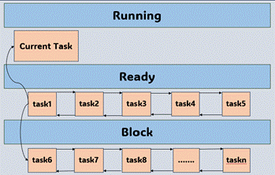

<div align="center"><h1><b><font size=7>阶段性技术报告</font></b></h1></div>
<div align="center"><font size=5>2024 年全国大学生计算机系统能力大赛操作系统设计赛——功能赛道</font></div>
<div align="center"><font size=5>赛题选择：[proj317--efficient-user-level-threads-scheduling-and-mapping]</font></div>
<div align="center"><font size=5>队伍名称：大企鹅</font></div>
<div align="center"><font size=5>队员姓名：高怡香、王月妮、刘冰</font></div>
<div align="center"><font size=5>指导教师：陈莉君教授、谢瑞莲老师</font></div>
<div align="center"><font size=5>项目导师：任玉鑫、吴一凡</font></div>
<div align="center"><font size=5>学校名称：西安邮电大学</font></div>

---
[TOC]

## 一、项目介绍

选题：proj317--efficient-user-level-threads-scheduling-and-mapping

项目名称：高效用户态线程调度

### 项目背景

原生的Linux是支持多任务，即用户态可以创建多个Linux线程运行，但是因为Linux线程由内核统一管理，所以任务的调度粒度都是内核决定的。在一些数据处理相关的场景下，常将一个大的计算模型分解成多个小的计算任务。在原生Linux中使用Linux线程来执行多个小的计算任务，由于原生Linux线程的调度是由Linux内核决定的，所以多个计算任务的切换会花费大量的切换时间。因此，通过本项目提出的高效用户态线程调度，让多个小任务尽可能的在一个进程（单线程进程）中执行，可以减少大量不必要的切换时间，并且能够更好的利用程序的局部性原理。

基于这样的现状和需求，得出需要在用户态对任务的粒度更加细化，来更好的让任务进行处理，避免内核态下任务的频繁切换。所以提出一种Linux用户态下多任务的想法，对比目前的协程的优势和不足，计划设计出一个用户态抢占式的任务调度框架。希望达到如下目标：

- 支持用户态抢占式任务调度：多个任务之间的执行相互独立；
- 支持百万级的任务数量：能够支持大规模任务的执行；
-  支持多个调度策略：适应更多的应用场景。

## 二、技术背景分析

目前常见的调度模型有进程、线程和协程，下文简要分析了这三种调度模型。

### 2.1 进程与线程

Linux操作系统中，拥有资源和独立调度的基本单位都是进程。在引入线程的操作系统中，线程是独立调度的基本单位，进程是资源拥有的基本单位。同一进程中，线程的切换不会引起进程切换。在不同进程中进行线程切换，如从一个进程内的线程切换到另一个进程中的线程时，会引起进程切换。

Linux原生支持进程与线程，所以Linux进程与线程使用方便，并且Linux内核对进程与线程的支持很全面。但是当进程与线程发生切换时，期间涉及的上下文切换和缓存刷新代价相对较大。

### 2.2 协程

协程往往将用户态的一个任务分解成多个任务相互运行，在众多协程库中，go语言协程管理的框架如下。

go 协程调度主要基于 GMP 模型，下面是对 go 1.5.1协程调度框架的解释。

- M---System Thread 系统线程。

- P---Processor go语言实现的协程处理器。

- G---Goroutine 协程。

1. 每一个 System Thread 有一个 Processor , 每个 Processor 挂着一个正在运行的协程队列，Processor 依次运行挂在上面的协程，如果一个协程运行时间很长，有可能会阻塞住整个协程队列，所以在 go 程序运行起来的时候会有一个守护线程，去记录每个 Processor 运行完成的协程数量，如果有一段时间发现某个 Processor 很长时间执行完的协程数量没有发生变化，则会往协程的任务栈中插入一个特别的标记，当这个协程运行的时候遇见非内联函数时，就会读到这个标记，就会把自己中断下去，把自己插到等候协程队列的队尾，切换成别的协程运行。
2. 另一个机制是，如果某一个协程被系统中断了，例如IO，需要等待，为了提高系统并发， Processor 会把他移动到另一个可用的系统线程之中。继续去运行所挂队列中其他的协程，当被中断的协程被唤醒完成之后，会把自己加到全局等待队列里或者某个 Processor 的协程等待队列中。
3. 当一个协程中断，他在寄存器里的运行状态也会保存在协程对象里,如果在次运行会将运行状态弹回寄存器中。

**优点**

- 作为 go 语言安身立命的根本, go 的协程调度实现了真正的通用性。

- 实现了多线程的任务调度，可以完美的利用多核性能。

- 性能在多次迭代之后十分优秀。

**缺点**

- 在 go1.5.1 的时候, go 实现的是基于协作式的抢占式调度器，并不是真正的抢占式调度(但是 go 在1.14之后实现了基于信号的真抢占式调度)

## 三、方案设计

综合以上对于线程及协程的相关调研，以上几种协程框架都有自己的优势和局限性，不能单纯去参考某一个框架。需要根据实际要求和需要去设计与实现。结合赛题明确本项目的目标是实现一个用户态抢占式任务调度框架。在协程的实现中，虽然协程也是在用户态运行的小任务，但是这些小任务之间的运行相互依赖，即一个任务需要主动退出。本项目实现的用户态抢占式任务调度框架中，任务之间相互独立。最终设计的用户态抢占式任务调度框架图如下所示。

<div align=center>

</div>

​                                                                           

为实现用户态抢占式的任务调度，需要在用户态进程中加入一个中断模块，该中断模块为每个任务提供抢占点。

使用该任务管理框架创建的任务需要在该任务管理框架中存在一个任务管理实体，并且该任务框里框架需要对每个任务管理实体进行统一管理，该部分的功能即为上图中的任务管理模块。

由于每个任务之间可能存在共享资源，则每个任务之间可能存在竞争关系，所以需要增加上图中的锁模块让每个任务更合理的使用共享资源。

由于进程的控制台等进程资源只有一个，所以同一时刻只能有一个任务使用控制台等进程资源，该项目目前已实现图中的输出管理模块，该模块即用来提供一个统一的接口供每个任务使用控制台资源。

该框架只提供有限的任务接口供用户使用，提供的接口组成上图中的接口层。用户态使用提供的接口创建任务后，每个任务是在同一个进程中运行的，即上图中表示的每个上层任务。

### 3.1 中断模块

该任务管理框架的中断模块使用信号机制实现，因为信号能够导致一个正在执行的进程被一个正在执行的异步进程中断，转而处理某一个突发事件，信号机制在用户空间和内核空间充当桥梁，建立用户空间进程和内核空间进程的交互，内核进程可以通过信号来通知用户空间进程发生的系统调用事件。

具体流程如下：通过设置定时时间，定时发送信号触发对应的定时处理函数。这里是通过signal(SIGALRM, signal_headler);来实现的。每次终端进入信号处理函数，在信号处理函数中查询是否有更高优先级的任务，有的话则切换到任务上下文，调度高优先级的任务，如果没有找到比当前任务更高优先级的任务，则将正在运行的任务时间片减一，如果时间片为0，则继续调度另外一个任务执行。

 

该任务管理框架的信号处理流程如下图所示。

<div align=center>

</div>

​																						

上图中每当一个信号到来时进入该框架中的信号处理流程中。在该流程中会判断每个任务的ticks是否为0，若为0则进行任务切换、否则将任务的ticks减一，并继续执行该任务。每个时钟信号到达用户态。但这会导致两个问题：
- 信号处理函数的执行需要很多时间；
- 大量因信号处理导致的用户态-内核态切换

对应的解决方法是：
- 减少信号处理函数的执行时间；
- 减少因信号处理导致的用户态-内核态切换

经过和陈莉君教授以及师兄师姐的讨论，并结合自身的知识储备，决定采用eBPF来解决这一问题，即减少触发信号处理的次数，也就是把当前任务的ticks计数和切换分开，当前任务的ticks计数使用eBPF或者kprobe在内核里进行，在需要切换的时候使用信号打断用户态程序的执行流（进而进行任务切换），任务切换的信号不使用时钟信号，使用用户自定义信号（SIGUSR1或SIGUSR2）。通过发送用户自定义的信号，User_Schedule进程注册的自定义信号处理函数里进行上下文切换。

### 3.2 任务管理模块

就绪队列目前采用FIFO的简单方式，阻塞队列主要功能是对屏幕资源的阻塞。调度器维护一个任务队列。每创建一个任务或者任务时间片到期将该任务加入到队尾，schedule函数从队头得到一个任务作为下一个要运行的任务。

目前实现了单核处理机运行的框架，任务管理模块框架如下图所示。

<div align=center>

</div>


后期目标是在多核处理机上进行实现，多任务模块启动时，会根据处理器核心数创建n个线程。为了提升多核平台的资源利用率和系统运行性能，将每个线程绑定在一个独立的处理器运行运行。全局会有一个所有任务的记录，当一个处理线程的任务执行完毕后，可以根据全局记录的任务从别的处理器线程获得任务，实现任务与处理器线程之间的负载均衡

## 四、难点及解决 

该项目的目标为实现一个用户态抢占式的任务调度框架，该目标中存在两个主要的难点。第一个难点为任务之间的独立性，并且每个任务是通过抢占式进行调度的；第二个难点是保存任务的上下文，即如何确定保存哪些任务上下文。

### 4.1 任务的独立性和可抢占

任务的独立性即任务的执行流相互独立，任务的切换在大多数时间为被动的。为此，需要为在用户态找到一个能够打断任务执行流的中断源，Linux操作系统中信号机制可以打断用户态的执行流，所以本项目选用信号作为中断源。Linux原信号处理时序图（简化）如下所示。

<div align=center>

</div>

​																					

图中简化了Linux信号处理的流程，将内容更聚焦在一个任务与内核之间的交互。传统的信号处理流程中，假设用户注册了一个用户态信号处理函数。当一个信号到来时，信号的响应首先发生在内核态。内核发现用户注册了一个用户态的信号处理函数，则需要为用户态信号处理函数构造一个用户栈空间，供用户态的信号处理函数使用。内核返回到用户态执行用户注册的信号处理函数，处理完成后，使用sigreturn系统调用，根据构造的栈空间返回内核执行，后续根据栈空间中指定的用户态返回地址返回用户空间继续执行后续操作。

在Linux原处理流程中，内核发现用户注册了用户态信号处理函数，所以为用户构造了一个用户态空间的栈，并且在执行sigreturn返回内核态后，根据该用户态的栈空间记录的返回地址，返回用户态原来的执行流继续执行。该过程中用户态的栈空间由于是在用户态空间，所以提供给信号处理函数一个时机去改变用户态任务的执行流。本项目使用该时机进行任务上下文的切换，任务切换的时序图如下图所示。

<div align=center>

</div>


利用信号处理函数可以修改信号栈的时机，在信号处理函数中修改信号返回用户正常执行流的返回地址，在信号处理函数执行sigreturn返回内核态后，内核根据修改后的信号返回地址返回用户态，就实现了任务之间的切换。时序图中所展示的任务切换不修改原Linux的信号处理流程，并且将每个任务的执行流相互独立。

### 4.2 任务上下文的确定

根据前面的分析，修改该结构体中的信号返回地址即可修改任务的执行流，所以将该结构作为任务上下文是可行的。本项目通过task_struct结构体管理任务，其中struct sigcontext处理信号保存和恢复任务上下文状态。以下为本项目的task_struct结构体以及sigcontext内容。

task_struct结构体源码如下：

```c
/**
 * task_struct
 * 任务的结构体
*/
struct task_struct
{
    uint64_t* task_stack;   //指向任务的栈顶
    uint8_t* stack_min_addr;    //任务的栈底地址
    sigjmp_buf env;         //用于保存协程上下文环境的缓冲区
    struct sigcontext context;   //进程的上下文
    tid_t tid;   //任务id
    enum task_status status;   //任务状态
    char name[32];   //任务名
    uint8_t priority;   //任务优先级，通过优先级设置时间片
    uint8_t ticks;   //每次处理器上执行的时间嘀嗒数，任务的时间片
    uint32_t elapsed_ticks;   //任务从开始到结束的总滴答数

    struct list_elem general_tag;//就绪elem
    struct list_elem all_list_tag;//all_list elem
    struct list_elem pool_tag; // pool elem

    //第一次调度的时候使用
    task_func* function;
    void* func_args;   // function(func_args);
    uint32_t stack_magic;
    unsigned int sleep_millisecond; // 用于存储超时时间，粒度为毫秒
    bool first; //任务是否第一次执行

    // 用于记录此协程是否用户希望被hook
    bool is_hook;

    // 用于记录此协程是否是一个时间片未跑完，但是因为调用了阻塞式系统调用而导致应该被调度
    bool is_collaborative_schedule;
};

```

sigcontext结构体源码如下：

```assembly

; struct sigcontext
; {
;   __uint64_t r8;
;   __uint64_t r9;
;   __uint64_t r10;
;   __uint64_t r11;
;   __uint64_t r12;
;   __uint64_t r13;
;   __uint64_t r14;
;   __uint64_t r15;
;   __uint64_t rdi;
;   __uint64_t rsi;
;   __uint64_t rbp;
;   __uint64_t rbx;
;   __uint64_t rdx;
;   __uint64_t rax;
;   __uint64_t rcx;
;   __uint64_t rsp;
;   __uint64_t rip;
;   __uint64_t eflags;
;   unsigned short cs;
;   unsigned short gs;
;   unsigned short fs;
;   unsigned short __pad0;
;   __uint64_t err;
;   __uint64_t trapno;
;   __uint64_t oldmask;
;   __uint64_t cr2;
;   __extension__ union
;     {
;       struct _fpstate * fpstate;
;       __uint64_t __fpstate_word;
;     };
;   __uint64_t __reserved1 [8];
; };

```

操作系统加载程序启动时，创建进程，设置栈指针sp指向用户栈的main()栈帧，接收到SIGALRM，产生信号中断，陷入内核，执行信号处理的回调函数signal_headler，在信号处理函数执行的时候，会保存当前进程的context于task_struct，通过调度算法选中下一个要执行的进程，将进程的上下文状态保存在task_struct，完成上下文切换，控制权由新进程掌控，信号处理函数执行完成之后，调用sigreturn 从用户空间返回内核空间，最终内核使用保存在内核栈中的上下文状态来恢复进程。如下图是任务切换的流程。

<div align=center>

</div>


# 五、运行效果

目前项目实现了多任务的调度，包括初始化主任务，创建任务，任务调度及任务退出。使用SIGALARM信号进行调度。运行结果如下所示。

<div align=center>

</div>


首先进行初始化，tid为0的任务为主任务，创建了两个任务test和test1。主任务调用pause()阻塞。终端显示了创建的三个任务的信息，开始调度test和test1任务。

实现在一个多任务操作系统环境中模拟创建并运行不同类型的任务，启动一个任务test只执行一次，并循环创建25个test1任务让其持续运行，并统计整个任务执行的总时间。代码如下：

```c
#include "task.h"
#include "console.h"
#include "init.h"
#include <stdio.h>
#include <unistd.h>
#include <sys/time.h>
#include <pthread.h>

void test(void *args)
{
    char *str = args;
    console_put_str(str);
}

void test1(void *args)
{
    char *str = args;
    while (1)
    {
        sleep(1);
        console_put_str(str);
    }
}

/* cpu密集 */
void test2(void *args)
{
    while (1);
}

/* io密集 */
void test3(void *args)
{
    while (1)
    {
        sleep(1);
        console_put_str("rrr\n");
    }
}

const static int thread_number = 25;

int main()
{
    struct timeval start_time, end_time;
    gettimeofday(&start_time, NULL); // 获取开始时间
    init();
    task_start("test1", 31, test, "argA ");
    for (int i = 0; i < thread_number; i++)
    {
        task_start("abc", 31, test1, "a ");
    }
    int loop_count = 100;
    while (loop_count--)
    {
        sleep(1);
        console_put_str("maiN \n");
    }
    gettimeofday(&end_time, NULL); // 获取结束时间
    // 计算时间
    long seconds = end_time.tv_sec - start_time.tv_sec;        // 秒差
    long microseconds = end_time.tv_usec - start_time.tv_usec; // 微妙差

    // 去掉负值
    if (microseconds < 0)
    {
        /*
             由于结束的微妙可能小于开始的微妙值，差值就会为负值
             需要借秒，减去1秒，加到微妙上面。
             */
        seconds -= 1;
        microseconds += 1000000;
    }

    // 秒
    double mintus = seconds + microseconds / 1000000.0;

    // 打印其时间差
    printf("Consumption of time time: %.3f seconds.\n", mintus);
    return 0;
}

```

运行效果图、统计时间如下：

<div align=center>

</div>


# 六、展望

本项目目前使用的任务管理和调度策略较简单，无法适应复杂的各种应用场景。针对不同的应用场景提供更为合适的调度策略成为本项目的一个扩展方向。

本项目实现的关键点在用户态抢占式的任务调度，要实现抢占式的调度，就需要为执行流提供一个抢占点。本项目的抢占点由信号提供，由于信号的处理过程依然比较复杂，在任务切换的过程中会消耗较多的时间，所以如何缩短切换时间就成为了本项目的一个发展方向。目前risc-v架构和x86架构部分硬件已经支持了用户态中断，未来可研究使用用户态中断为本项目提供抢占点，来缩短任务的切换时间。但是经过调研发现用户态中断这个硬件比较新，只有intel团队维护的Linux支持用户态中断，因此暂时放弃做用户态中断的方案，继续使用信号来实现任务独立性和可抢占。

在中断模块经过讨论结合eBPF实现的具体思路大概如下：

1、注册eBPF程序的时候获取User_schedule程序的进程PID

2、内核调度User_schedule，运行eBPF程序

3、eBPF程序进行判断User_schedule程序，进行任务ticks计数

4、任务切换时候向User_schedule进程发送信号，发送时机在User_schedule进程检查信号集之前

5、发送自定义信号，User_schedule进程注册的自定义信号处理函数里进行上下文切换

6、将 User_schedule 应用在大模型上

# 七、阶段性收获

- 经过调研初步拟定了两种实现方案，方案一：使用一个用户态的操作系统去进行调度，但是难度过大且性能上面也不能做出保证；方案二：实现一个用户态抢占式任务调度框架。
- 拟定实现方案二，结合现有的协程框架的调研结果，并未找到可以解决各个任务执行性完全独立的方案，本项目打算在调度器schedule下模拟出中断层，使用该中断作为任务切换的基础。
- 通过signal模拟信号量产生中断的过程中，将理论转化为实践，收获很大。
- 在开发过程中，对linux内核中进程、线程、协程等方面知识有了从理论到实践的认识。
- 开发过程中需要考虑将功能模块（上下文切换、调度、信号处理等）进行分层化、模块化，方便后期进行移植。
- 对任务调度相关知识有了更深入的认识，用户态开发与内核态开发完全不同，用户态开发时无法直接使用内核的一些机制。
