[TOC]

# 技术文档

## Linux 0.11进程

在Linux操作系统上同时运行多个进程依靠的是分时技术，分时技术把CPU运行时间分成一个个规定长度的时间片，让每个进程在一个时间片内运行，在单核CPU上虽然某时刻只能运行一个进程，但是由于是键盘很短，所以好像所有进程都在运行。本项目可以参考进程的分时技术，把每一个任务分配一定的时间片，在用户态下依靠定时信号SIGALARM来模拟中断，实现对任务分时，但是由于大多是CPU密集型任务，所以时间片也许需要更长一点(Linux0.11 15毫秒)，避免任务切换的频率过高。

Linux0.11下内核通过对进程表对进程进行管理，每个进程在进程表中占有一项。在Linux系统中，每个进程对应一个task_struct称为PCB，本项目中任务抽象为TCP,详细介绍见下文。

进程的状态有运行状态、可中断睡眠状态、不可中断睡眠状态、暂停状态和僵死状态，为此本项目中任务暂时设计运行状态(TASK_RUNNING)、阻塞状态(TASK_BLOCKED)和就绪态(TASK_READY)三种状态。下图为Linux0.11进程状态转换关系图。

<div align=center>
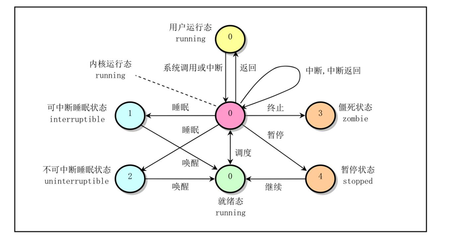
</div>

​											

完成创建任务、任务调度、任务切换和终止任务，除此之外还要考虑任务对堆栈的使用。

下面是进程切换的堆栈切换示意图。

<div align=center>
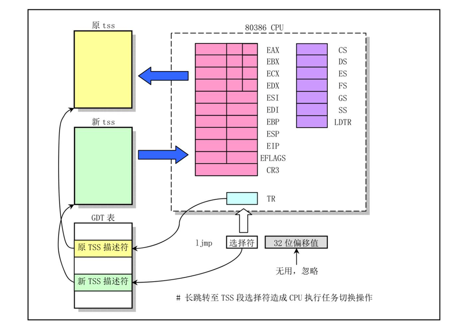
</div>


​											


## 任务切换的两个要点

- 保存现场：保存现场则是保存CPU内部的寄存器状态，保存接下来需要执行的指令就是需要保存接下来要执行的指令的地址。这些内容保存在线程的栈里面
- 记录接下来需要执行的指令。

具体来说，任务的切换有以下几个要点:
1.需要为每一个任务设立一个独立的，互相不千扰的栈空间.
2.当线程发生切换的时候，当前线程被切换之前，需要把自己的现场进行完好的保留，同时记录下下一条需要执行指令的指令地址。
3.把CPU的栈顶指针寄存器esp切换到即将被调入的线程的堆栈的栈顶地址，完成了栈空间的切换。

经过上述这几个步骤，完成任务的切换，由于上面的步骤需要直接访问CPU的寄存器，于是这个过程往往是采用汇编的方式来进行。

<div align=center>
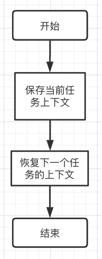
</div>


​									

第一次执行的任务的上下文在创建的时候指定好，其中rip寄存器的位置指向统一的函数，该函数首先打开中断然后调用任务函数。

## 实现过程

- 建立描述进程的数据结构task_struct
- 创建任务自己的栈，用于存储线程中待执行的函数
- 确定实现方案
  - 用高精度定时器做任务切换时钟。当到达设定时间内核会自动产生中断，进而执行回调函数。回调函数需要自己设定调度上下文切换逻辑
  - 抢占的实现需要明确优先级如何设定，结合信号来定时产生中断。
- 线程切换：线程的切换需要通过汇编来完成。因此需要编写汇编代码完成线程上下文的切换
- 实现线程的调度算法：本项目采用了FIFO调度类，在初始化任务的时候，每个任务的时间片设置为了每个任务的优先级

### 设置task_struct结构体

包含任务的状态，任务栈以及结构体。

```c
//以下是task的状态
enum task_status
{
    TASK_RUNNING,   //运行
    TASK_READY,     // 就绪
    TASK_BLOCKED,   //阻塞
    TASK_DIED,      //僵死
    TASK_WAITING,   //等待：任务正在等待某些事件的发生
    TASK_HANGING    //挂起：暂时停止执行
};

/**
 * task_stack
 * 任务自己的栈，用于存储线程中待执行的函数
 * **/
struct task_stack
{
    uint64_t rbx;
    uint64_t rbp;
    uint64_t r12;
    uint64_t r13;
    uint64_t r14;
    uint64_t r15;
    uint64_t rsp;   //栈指针,指向task的栈顶
    uint64_t rip;   //指令指针，指向task待执行的函数入口地址
};

/**
 * task_struct
 * 任务的结构体
*/
struct task_struct
{
    uint64_t* task_stack;   //指向任务的栈顶
    uint8_t* stack_min_addr;    //任务的栈底地址
    sigjmp_buf env;         //用于保存协程上下文环境的缓冲区
    struct sigcontext context;   //进程的上下文
    tid_t tid;   //任务id
    enum task_status status;   //任务状态
    char name[32];   //任务名
    uint8_t priority;   //任务优先级，通过优先级设置时间片
    uint8_t ticks;   //每次处理器上执行的时间嘀嗒数，任务的时间片
    uint32_t elapsed_ticks;   //任务从开始到结束的总滴答数

    struct list_elem general_tag;//就绪elem
    struct list_elem all_list_tag;//all_list elem
    struct list_elem pool_tag; // pool elem

    //第一次调度的时候使用
    task_func* function;
    void* func_args;   // function(func_args);
    uint32_t stack_magic;
    unsigned int sleep_millisecond; // 用于存储超时时间，粒度为毫秒
    bool first; //任务是否第一次执行

    // 用于记录此协程是否用户希望被hook
    bool is_hook;

    // 用于记录此协程是否是一个时间片未跑完，但是因为调用了阻塞式系统调用而导致应该被调度
    bool is_collaborative_schedule;
};
```

### 线程切换

线程切换主要是通过结构体sigcontext来实现的，本项目通过task_struct结构体管理任务，其中struct sigcontext处理信号保存和恢复任务上下文状态。 以下为本项目的sigcontext结构体内容。

```c
struct sigcontext
{
  __uint64_t r8;
  __uint64_t r9;
  __uint64_t r10;
  __uint64_t r11;
  __uint64_t r12;
  __uint64_t r13;
  __uint64_t r14;
  __uint64_t r15;
  __uint64_t rdi;
  __uint64_t rsi;
  __uint64_t rbp;
  __uint64_t rbx;
  __uint64_t rdx;
  __uint64_t rax;
  __uint64_t rcx;
  __uint64_t rsp;
  __uint64_t rip;
  __uint64_t eflags;
  unsigned short cs;
  unsigned short gs;
  unsigned short fs;
  unsigned short __pad0;
  __uint64_t err;
  __uint64_t trapno;
  __uint64_t oldmask;
  __uint64_t cr2;
  __extension__ union
    {
      struct _fpstate * fpstate;
      __uint64_t __fpstate_word;
    };
  __uint64_t __reserved1 [8];
};
```


​						

### 调度原理

用时钟中断驱动调度器，每次时钟中断判断分配给任务的时间片是否到期，如果没有到期就将时间片减一，如果到期就调用schedule函数切换任务。调度器中可以有不同的调度策略，暂时使用的调度策略为FIFO。

通过调度器维护一个任务队列。每创建一个任务或者任务时间片到期将该任务加入到队尾，schedule函数从对头得到一个任务作为下一个要运行的任务。ticks为该进程第一次处理时间中断后至今的滴答数，总滴答数。task->running_timer为当前任务占用CPU的时间。时钟处理流程如下：

<div align=center>
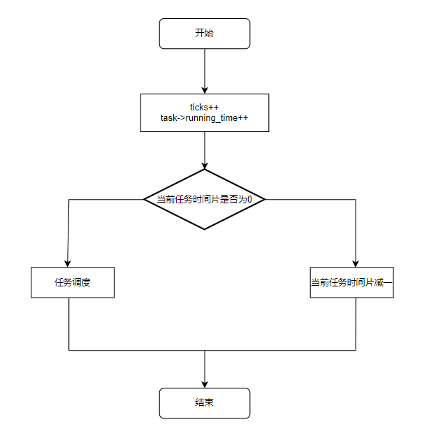
</div>


​					
任务调度流程如下：

<div align=center>
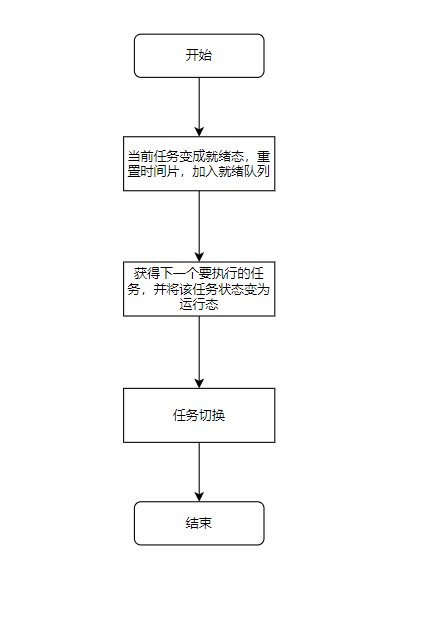
</div>


获得下一个执行的任务暂时使用的策略为FIFO，即从任务队列的对头取出任务。

## 用户态抢占式任务调度

用户态抢占式任务调度包括初始化主任务，创建任务，任务调度及任务退出。使用SIGALARM信号进行调度，其实现细节如下。

初始化操作，包括控制台、任务管理器、计时器、中断管理模块。

```c
void init()
{
  console_init();
  task_init();
  timer_init();
  interrupt_init();
  return;
}
```

初始化任务时，会调用`make_main_task()`将main函数创建为主任务

```c
void task_init(void)
{
  list_init(&task_ready_list);//初始化就绪态任务
  list_init(&task_all_list);//初始化所有任务
  list_init(&task_pool_list);//初始化当前未被使用的任务，以便后续重新分配
  task_all_nums = 0;//任务初始计数0
  tid_pool_init();//初始化任务id池
  //将当前main函数创建为任务
  make_main_task();
}
```

为主任务分配task_struct结构体，初始化当前任务，设定任务名以及优先级。

```c
/**

 \* make_main_task - 将main函数变为任务

 \* **/

static void make_main_task(void)
{
  main_task = (struct task_struct*)malloc(sizeof(struct task_struct));
  init_task(main_task, "main", 3);
  assert(!elem_find(&task_all_list, &main_task->all_list_tag));
  list_append(&task_all_list, &main_task->all_list_tag);
  task_all_nums++; 
}
```

初始化任务时，将任务名复制到`name`字段，便于输出，检查当前任务是否是主任务，主任务设定为运行态，标记为非首次调度，非主任务将其任务状态设定为就绪态，标记为首次调度，为当前任务分配一个tid，为任务堆栈分配内存空间，将任务堆栈指针指向堆栈顶部，初始化任务的优先级、魔数等信息。

```c
/**

初始化一个任务结构体，设定特定的属性。

@param ptask 指向要初始化的任务结构体的指针。

@param name 任务的名称。

@param prio 任务的优先级。
*/
void init_task(struct task_struct* ptask, const char* name, int prio)
{
memset(ptask, 0, sizeof(*ptask));
strcpy(ptask->name, name);
if(ptask == main_task) {
    ptask->status = TASK_RUNNING;
    ptask->first = false;
    current_task = ptask;
} else {
    ptask->status = TASK_READY;
    ptask->first = true;
}
ptask->tid = allocate_tid();
//任务堆栈分配内存
ptask->stack_min_addr = (uint8_t*)malloc(TASK_STACK_SIZE);

ptask->task_stack = (uint64_t*)(ptask->stack_min_addr + TASK_STACK_SIZE);

// 设置优先级和初始计时数（用于调度目的）
ptask->priority = prio;
ptask->ticks = prio;
ptask->elapsed_ticks = 0;
ptask->stack_magic = 0x19991120; // 用于检测栈溢出或腐败的魔术数字
ptask->sleep_millisecond = 0; //初始睡眠时间
ptask->is_hook = false;
ptask->is_collaborative_schedule = false;//任务最初不使用协作调度
}
```

调用`print_task_info()`打印当前主任务的tid、name、priority以及魔数。

```c
/**

 \* print_task_info - 打印task信息

 \* **/
void print_task_info(struct task_struct* ptask)
{
  printf("tid = %d\n", ptask->tid);
  printf("name = %s\n", ptask->name);
  printf("priority = %d\n", ptask->priority);
  printf("stack_magic = %x\n", ptask->stack_magic);
}
```

创建两个任务test和test1，让主任务调度pause()阻塞，在终端打印三个任务相关信息，接着调度test和test1任务。

```c
/**
 \* interrupt_enable - 中断使能

 \* **/
//开中断
void interrupt_enable()
{
 sigset_t sigset;
 sigemptyset(&sigset);
 sigaddset(&sigset, SIGALRM);
 sigprocmask(SIG_UNBLOCK, &sigset, NULL);//解除阻塞
}
```

向定义的信号集`sigset`中添加`SIGALRM`信号。

```c
/**

 \* interrupt_init - 中断启动
 *

 \* 初始化一个模拟的中断系统，使用定时信号来触发事件

 */

void interrupt_init()
{
 /* 模拟中断 */
 signal(SIGALRM, signal_headler);
 /* 10毫秒将会定时器SIGALRM就会唤醒一次中断 */
  if(set_ticker(10) == -1) {
  clock_granularity = 10;//记录定时器的精度或配置的时间间隔
  panic("set_ticker failed.");
 }
}
```

设置定时器10毫秒会模拟一次信号中断，利用回调函数`signal_headler`处理这些信号，其核心处理逻辑如下。

```c
/**

 \* interrupt_timer_handler - 时钟中断处理函数

 \* **/

void interrupt_timer_handler(unsigned long* a)
{

  assert(current_task->stack_magic == 0x19991120);
  current_task->elapsed_ticks++;  
  ticks++;  
  /* 时间片用尽执行 schedule() */
  
  if(NULL != timer_manager) {
    if(!timer_manager->uExitFlag) {
      run_timer();
   } else {
      destroy_timer_manager();
    }
  }
  if(current_task->is_collaborative_schedule == false && current_task->ticks == 0) {​    schedule(a);
  } else if(current_task->is_collaborative_schedule == false){   
    current_task->ticks--;
  } else {
    
    LPTIMERNODE timenode = create_timer(collaborative_schedule_helper, (void*)current_task, current_task->sleep_millisecond, 0); 
    collaborative_schedule(a);
  }

}
```

预定义的魔数值通常存储在堆栈底部，用于检测内核栈是否存在溢出情况。此外，在调度新任务前，首先执行定时器模块的相关操作。对于时间片已用尽的任务，函数调用`schedule()`来选择下一个要执行的任务，实现基于时间片的抢占式调度机制。对于采用协作调度的任务，如果其时间片已耗尽，系统会将该任务添加到定时器队列并设置必要的睡眠时间。

```c
/**

 \* schedule - 任务调度(signal handle)

 \* **/

void schedule(unsigned long* a)
{
  unsigned char* p;

  /* 保证在就绪队列中找不到task_ready_list */

  assert(!elem_find(&task_ready_list, &current_task->general_tag));

  /* 在就绪队列最后加上当前任务 */

  list_append(&task_ready_list, &current_task->general_tag);

  /* 设置当前任务的时间片 */

  current_task->ticks = current_task->priority;

  current_task->status = TASK_READY;


  if(list_empty(&task_ready_list)) {

    printf("task_ready_list is empty!\n");

    while(1){

      printf("nihao\n");

    };  // TODO 当main函数执行sleep的时候可能会卡死，因为hook后的sleep不会把current_task插入ready_list

  }


  struct task_struct* next = get_next_task();

  //从信号栈esp+72获得sigcontext的内容

  p = (unsigned char*)((unsigned char*)a + CONTEXT_OFFSET);

  struct sigcontext* context = (struct sigcontext*)p;

  /* 将当前任务的上下文保存到 current_task的上下文中 */

  memcpy(&current_task->context, context, sizeof(struct sigcontext));

  /* 将下个任务的上下文取出使用 */

  current_task = next;

  memcpy(context, &current_task->context, sizeof(struct sigcontext));

}
```

利用`get_next_task()`函数获取就绪队列中的下一个任务，此函数从任务队列中选择下一个应当执行的任务。在上下文切换过程中，当前进程的上下文（包括CPU寄存器和状态）被存储在其`task_struct`结构体的`context`字段中。将新选定的任务的上下文复制到信号栈，通过操作内存地址来完成，当信号处理函数完成之后，调用`sigreturn`系统调用从用户空间返回到内核空间，内核使用保存在内核栈中的上下文状态来恢复进程上下文状态，如下图。

<div align=center>

</div>


最终调试结果如下：tid为1的任务为主任务，并创建了两个任务test和test1。主任务调用`pause()`让其处于阻塞状态。终端显示已创建的三个任务的信息，其信息有tid、任务名、优先级、魔数，并且打印线程调度的相关信息，说明按照预期完成了任务调度以及上下文切换。

<div align=center>

</div>


## 优化任务调度

现阶段实现的中，使用信号的目的就是打断用户态程序的执行流，在信号的处理流程中，如下图，可以看出来每个时钟信号都会到达用户态，但这会导致大量用户态-内核态切换。因此下来就想办法减少因信号处理导致的用户态-内核态切换，也就是减少触发信号处理的次数。

<div align=center>

</div>


### 解决思路

要减少触发信号处理的次数，就可以把当前任务的ticks计数和切换分开，当前任务的ticks计数使用eBPF在内核里进行计数，或者采用内核模块实现，在需要切换的时候使用信号打断用户态程序的执行流，进而进行任务切换。在这块，任务切换的信号可以使用用户自定义信号。

实现计数在内核中进行，这里维护一个表，表中记录了每个任务对应的ticks，当任务的ticks为0，则发信号给 User_Schedule 进行任务切换，否则就正常运行，让ticks减一即可。

### 技术选取

在这里采用内核模块实现计数，在内核模块中实现挂载sched_switch，并通过与用户态之间的通信，实现阻塞特定任务。

###  内核态挂载点的选取

在内核态实现计数，如果采用 eBPF 来实现这一点，需要选取一个合适的挂载点，这个挂载点能感知到马上要运行的进程是什么，并且可以发送信号给该进程。

开始选取的挂载点是 schedule ，考虑到这个函数会被频繁调用，最终选取的挂载点是 sched_switch。 这个tracepoint的数据如下：

<div align=center>
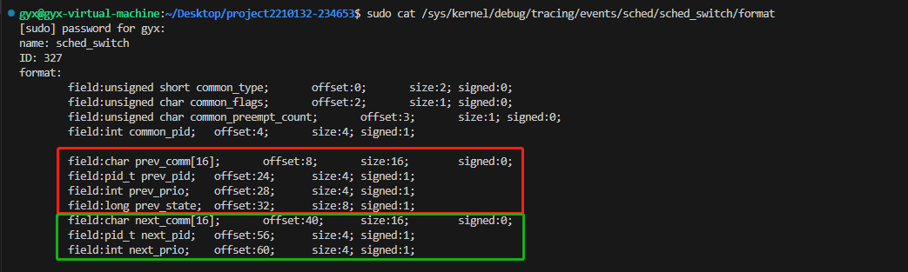
</div>

可以看出来，这个函数可以获取到下一个任务的相关信息，满足需求。

###  内核态挂载tracepoint

首先，找到内核中用于管理对应tracepoint的struct tracepoint结构体，然后在struct tracepoint对应成员填入自定义回调函数地址。

```c
struct interest_tracepoint
{
    void *callback;
    struct tracepoint *ptr;
    char is_registered; // 标记 tracepoint 是否已注册
};

// 宏定义，初始化一个 tracepoint 结构体
#define INIT_INTEREST_TRACEPOINT(tracepoint_name) \
    static struct interest_tracepoint tracepoint_name##_tracepoint = {.callback = NULL, .ptr = NULL, .is_registered = 0};

// 宏定义，查找指定名字的 tracepoint
#define TRACEPOINT_FIND(tracepoint_name)                                             \
    static void tracepoint_name##_tracepoint_find(struct tracepoint *tp, void *priv) \
    {                                                                                \
        if (!strcmp(#tracepoint_name, tp->name))                                     \
        {                                                                            \
            ((struct interest_tracepoint *)priv)->ptr = tp;                          \
            return;                                                                  \
        }                                                                            \
    }
// 用于注销 tracepoint 的回调函数
static void clear_tracepoint(struct interest_tracepoint *interest)
{
    if (interest->is_registered)
    {
        tracepoint_probe_unregister(interest->ptr, interest->callback, NULL);
    }
}


// 生成并初始化 struct interest_tracepoint 对象
INIT_INTEREST_TRACEPOINT(sched_switch)

// 生成用于查找 sched_switch tracepoint 的函数
TRACEPOINT_FIND(sched_switch)
    
    
// tracepoint 的回调函数
static void sched_switch_tracepoint_callback(void *data, bool preempt, struct task_struct *prev, struct task_struct *next)
{
    if (next->pid != target_pid)
        return;
    printk(KERN_INFO "sched_switch event\n");
    if (ticks > 0)
    {
        ticks--;
        printk(KERN_INFO "Ticks remaining: %d\n", ticks);

        if (ticks == 0)
        {
            queue_delayed_work(wq, &delayed_work, 0);
        }
    }
}

```

在内核模块初始化函数当中，完成注册sched_switch这个tracepoint，以及注册其回调。在模块注销函数中，注销 sched_switch这个 tracepoint

```c
// 内核模块初始化函数
static int __init netlink_init(void)
{
    // 查找 sched_switch tracepoint
    sched_switch_tracepoint.callback = sched_switch_tracepoint_callback;
    // 内核模块不能直接通过外部符号来访问tracepoint。所以需要用for_each_kernel_tracepoint遍历tracepoint表的方式来找到指定tracepoint。
    for_each_kernel_tracepoint(sched_switch_tracepoint_find, &sched_switch_tracepoint);

    if (!sched_switch_tracepoint.ptr)
    {
        pr_info("sched_switch's struct tracepoint not found\n");
        return 0;
    }

    // 注册 tracepoint
    tracepoint_probe_register(sched_switch_tracepoint.ptr, sched_switch_tracepoint.callback, NULL);

    sched_switch_tracepoint.is_registered = 1;
    return 0;
}

// 内核模块卸载函数
static void __exit netlink_exit(void)
{
    // 注销 tracepoint
    clear_tracepoint(&sched_switch_tracepoint);
}
```

实现效果如下：

<div align=center>
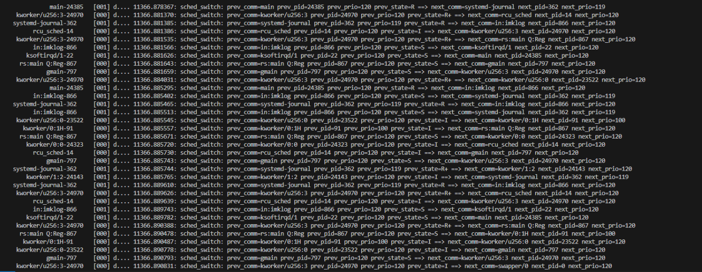
</div>


### Netlink机制

Netlink为用户空间进程提供了一个标准的基于套接字的接口，可以实现Linux内核与用户空间的双向数据传输。在这里需要去使用 Netlink 机制来获取用户态传来的pid。

####  用户态

```c
#define NETLINK_USER 31

struct sockaddr_nl src_addr, dest_addr;	//源和目的sockaddr_nl结构体，用于 Netlink 套接字的地址绑定和消息发送
struct nlmsghdr *nlh = NULL;	//netlink消息结构体，用于构建发送到内核的消息
struct iovec iov;
int sock_fd;	//用于构建发送到内核的消息
struct msghdr msg; 	// 消息头结构体
int main()
{
    pid_t pid = getpid();

    // 创建 Netlink 套接字
    sock_fd = socket(PF_NETLINK, SOCK_RAW, NETLINK_USER);
    if (sock_fd < 0)
    {
        perror("socket");
        return -1;
    }
	 // 初始化源地址结构体
    memset(&src_addr, 0, sizeof(src_addr));
    src_addr.nl_family = AF_NETLINK;
    src_addr.nl_pid = getpid(); // 使用当前进程的 PID
    
	//将源地址绑定到套接字上
    if (bind(sock_fd, (struct sockaddr *)&src_addr, sizeof(src_addr)) < 0)
    {
        perror("bind");
        close(sock_fd);
        return -1;
    }
    
	// 初始化目的地址结构体
    memset(&dest_addr, 0, sizeof(dest_addr));
    dest_addr.nl_family = AF_NETLINK;
    dest_addr.nl_pid = 0;    // 目标为内核
    dest_addr.nl_groups = 0; // 单播

    // 分配内存用于 Netlink 消息头
    nlh = (struct nlmsghdr *)malloc(NLMSG_SPACE(sizeof(int)));
    if (nlh == NULL)
    {
        perror("malloc");
        close(sock_fd);
        return -1;
    }
    memset(nlh, 0, NLMSG_SPACE(sizeof(int)));
    nlh->nlmsg_len = NLMSG_SPACE(sizeof(int));
    nlh->nlmsg_pid = getpid(); // 消息来源的进程 PID
    nlh->nlmsg_flags = 0;

    // 将 PID 复制到 Netlink 消息数据部分
    memcpy(NLMSG_DATA(nlh), &pid, sizeof(pid));

    // 设置 iovec 结构体，指向 Netlink 消息
    struct iovec iov = {
        .iov_base = (void *)nlh,
        .iov_len = nlh->nlmsg_len};

    // 设置 msghdr 结构体，指定消息头和目标地址
    struct msghdr msg = {
        .msg_name = (void *)&dest_addr,
        .msg_namelen = sizeof(dest_addr),
        .msg_iov = &iov,
        .msg_iovlen = 1};

    // 发送构建好的消息到内核模块
    sendmsg(sock_fd, &msg, 0);
    printf("Sent PID %d to kernel module\n", pid);
    const static int thread_number = 25;
    init();
    task_start("test1", 31, test, "argA ");
    
    // 释放内存关闭套接字
    free(nlh);
    close(sock_fd);
    return 0;
}
```

####  内核态

```c
#define NETLINK_USER 31
// 定义一个 Netlink 套接字，用于内核和用户空间之间的通信
struct sock *nl_sk = NULL;

int target_pid = -1;


// Netlink 套接字接收到消息后的处理函数
static void netlink_recv_msg(struct sk_buff *skb)
{
    struct nlmsghdr *nlh;
    int pid;
    struct sk_buff *skb_out;
    int msg_size;
    int res;

    nlh = (struct nlmsghdr *)skb->data;
    pid = *(int *)nlmsg_data(nlh);
    target_pid = pid; // 保存目标 PID
    pr_info("Received PID: %d\n", target_pid);
    msg_size = sizeof(int);
    skb_out = nlmsg_new(msg_size, 0);
    if (!skb_out)
    {
        pr_err("Failed to allocate new skb\n");
        return;
    }

    nlh = nlmsg_put(skb_out, 0, 0, NLMSG_DONE, msg_size, 0);
    NETLINK_CB(skb_out).dst_group = 0;
    *(int *)nlmsg_data(nlh) = target_pid;

    // 将消息发送回用户空间
    res = nlmsg_unicast(nl_sk, skb_out, target_pid);
    if (res < 0)
        pr_err("Error while sending back to user\n");
}

```

在内核模块初始化函数中创建 Netlink 套接字，在内核模块注销函数中销毁 Netlink 套接字。

最终实现的效果如图：

<div align=center>
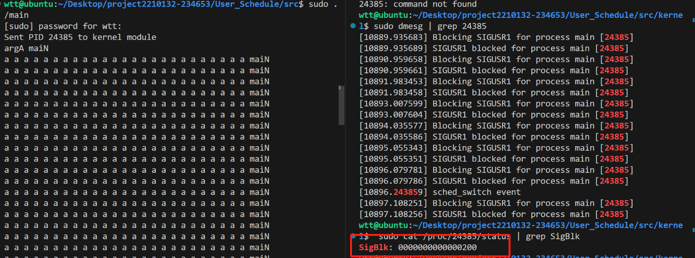
</div>


### 计时功能实现


前面提到过，将计时和调度进行分离，计时在内核态实现，调度在用户态实现。接下来重新梳理了代码的流程：在用户态将任务pid通过 Netlink 发送到内核态，内核态首先会判断该任务的时间片是否为0，若为0，则发送用户态自定义信号，调用信号处理函数，即直接进行任务的上下文切换。

```c
// 延迟工作队列的工作函数，阻塞指定 PID 的 SIGUSR1 信号
static void block_sigusr1_for_pid(struct work_struct *work)
{
    struct task_struct *task;
    sigset_t new_mask;

    // 读取 RCU 保护的任务结构体
    rcu_read_lock();
    task = pid_task(find_vpid(target_pid), PIDTYPE_PID);

    if (task)
    {
        if (task->pid != target_pid)
            return;
        get_task_struct(task);
        rcu_read_unlock();

        printk(KERN_INFO "Blocking SIGUSR1 for process %s [%d]\n", task->comm, task->pid);
        if (ticks == 0)
        {
            // 初始化新的信号集，阻塞 SIGUSR1
            sigemptyset(&new_mask);
            sigaddset(&new_mask, SIGUSR1);

            // 修改进程的信号阻塞集
            spin_lock_irq(&task->sighand->siglock);
            task->blocked = new_mask;
            recalc_sigpending(); // 更新挂起的信号
            spin_unlock_irq(&task->sighand->siglock);

            printk(KERN_INFO "SIGUSR1 blocked for process %s [%d]\n", task->comm, task->pid);
            return;
        }
        put_task_struct(task);
    }
    else
    {
        rcu_read_unlock();
        pr_err("Task with PID %d not found\n", target_pid);
    }
    if (ticks > 0)
        // 重新排队延迟工作
        queue_delayed_work(wq, &delayed_work, msecs_to_jiffies(1000)); // 1 秒延迟
}


```

## 大模型调研


这里分析了 [百度的Apollo](https://www.apollo.auto/apollo-self-driving)以及[ROS2](https://www.ros.org/)框架，这里仅仅是一个大概的介绍，详细内容请见

### 百度 Apollo

Apollo (阿波罗)是一个开放的、完整的、安全的平台，Apollo 车端通过数据采集器生成开放的数据集，并通过云端大规模集群训练生成各种模型和车 辆配置，之后通过仿真验证，最后再部署到 Apollo 车端，无缝连接。这整个过程其实包含了 2 个迭代循环，一个是模型配置迭代，一 个是代码迭代，都通过数据来驱动。下图是Apollo的架构图。

<div align=center>
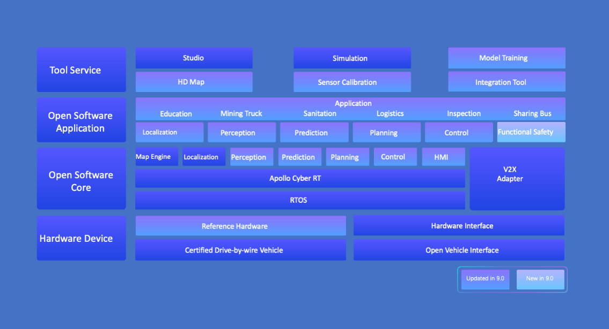
</div>


[调度器](https://github.com/ApolloAuto/apollo/tree/master/cyber/scheduler) 是Apollo自动驾驶框架的重要组成部分，负责管理任务的调度和执行，以确保实时性能和效率，Apollo Cyber RT 系统是一个独立运行时框架，可以**更加轻松构建自动驾驶技术方案**。**Apollo Cyber RT 框架核心理念是基于的组件，组件有预先设定的输入输出。**

实际上，每个组件就代表一个专用得算法模块。框架可以根据所有预定义的组件生成有向无环图 (DAG)。**在运行时刻，框架把融合好的传感器数据和预定义的组件打包在一起形成用户级轻量任务，之后，框架的调度器可以根据资源可用性和任务优先级来派发这些任务**

除此，百度Apollo提供了统一的调度接口，以便进行功能扩展。

<div align=center>
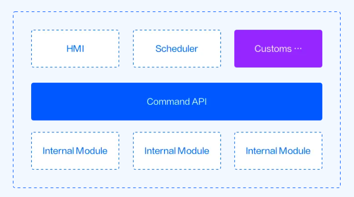
</div>

针对需要实现自定义调度逻辑的自动驾驶应用的扩展场景，增加了统一的接口模块，并对已有的规划功能进行封装。只需基于接口开发调度模块，即可实现特定应用场景的自动驾驶，最快1天内即可完成场景Demo搭建。


### ROS框架

ROS是机器人操作系统的英文缩写，ROS是用于构建机器人应用程序的软件开发工具包。ROS是开源的，它由一组软件库和若干工具组成。在机器人领域，ROS是一个标准软件平台，这个平台为开发者提供了构建机器人应用程序所需的各个功能模块，并且开发者能够以“可插拔”的方式组织各个功能模块。整个ROS生态由通信（Plumbing）、工具（Tools）、功能（Capabilities）与社区（Community）四大部分组成。

####  通信(Plumbing)

通信是整个ROS系统的核心实现，是ROS内置的一个消息传递系统，通常称之为middleware（中间件）或Plumbing（管道）。

在构建新的应用程序或使用与硬件交互的软件时，如何实现通信是首当其冲的问题，为此ROS提供了专门的消息传递系统，它可以管理不同节点之间的通信细节，提高开发者的工作效率。这套消息传递系统使用了“面向接口”的编程思想，可以通过清晰规范的接口，将不同模块分离，从而也将故障隔离。使得ROS系统更易于维护、扩展性更强且保证了程序的高复用性。

接口规范可以由开发者自行定义。同时为了方便使用，在ROS中也提供了许多标准的接口，这些标准接口有着广泛应用，比如：将雷达或摄像头数据传输到可视化的用户界面或是传输到定位算法模块，都会使用到标准接口。

####  工具(Tools)

构建机器人应用程序极具挑战性。开发者除了会遇到一些传统的软件开发问题之外，还需要通过传感器或执行器与物理世界进行异步交互。显而易见的，良好的开发工具可以提高应用程序的开发效率，在ROS中就内置了launch、调试、可视化、绘图、录制回放等一系列工具。这些工具不光可以提高开发效率，还可以在发布产品时直接包含在产品之中。

#### 功能(Capabilities)

ROS生态系统是机器人软件的聚宝盆。无论开发者需要用于GPS的设备驱动程序、用于四足仿生机器人的步行和平衡控制器，还是用于移动机器人的地图系统，ROS都能满足你的需求。从驱动程序到算法，再到用户界面，ROS都提供了相关实现，开发者只需专注于自身应用程序即可。

ROS的目标是提供一站式的技术支持，降低构建机器人应用程序的门槛。ROS希望任何开发者都可以将自己的“创意”变为现实，而无需了解底层软件和硬件的所有内容。

#### 社区(Community)

ROS社区规模庞大、多样且全球化，从学生和业余爱好者到跨国公司和政府机构，各行各业的人和组织都在推动着ROS项目的发展。

该项目的社区中心和中立管家是Open Robotics，它托管共享在线服务(例如ROS官网：https://www.ros.org/)，创建和管理分发版本（包括您安装的二进制包），并开发和维护大部分ROS核心软件。Open Robotics还提供与 ROS 相关的工程服务。

## ROS2框架


 ROS2是一种面向机器人技术的操作系统。它为开发者提供了丰富的工具和库，用于构建、测试和执行各种复杂的机器人程序。ROS2的出现极大地提高了机器人开发的效率，降低了技术门槛，使得更多的开发者能够参与到机器人技术的创新中来。 ROS2由一系列的软件包组成，包括基础框架、功能包、工具集以及其他的库。它的核心是一个消息传递系统，用于在不同的软件包之间传递信息。ROS2的架构灵活，可以支持从小型桌面机器人到大型工业机器人的各种应用场景。

<div align=center>
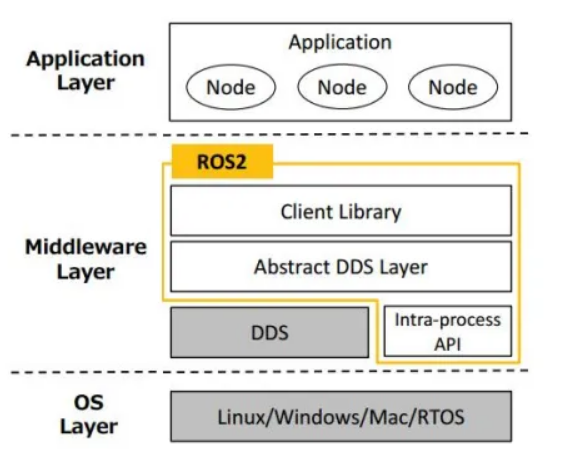
</div>

立足系统架构，如上图所示，ROS2可以划分为三层：

- **操作系统层（OS Layer）**

  如前所述，ROS虽然称之为机器人操作系统，但实质只是构建机器人应用程序的软件开发工具包，ROS必须依赖于传统意义的操作系统，目前ROS2可以运行在Linux、Windows、Mac或RTOS上。

- **中间层（Middleware Layer）**

  主要由数据分发服务DDS与ROS2封装的关于机器人开发的中间件组成。DDS是一种去中心化的数据通讯方式，ROS2还引入了服务质量管理 （Quality of Service）机制，借助该机制可以保证在某些较差网络环境下也可以具备良好的通讯效果。ROS2中间件则主要由客户端库、DDS抽象层与进程内通讯API构成。

- **应用层（Application Layer）**

  是指开发者构建的应用程序，在应用程序中是以功能包为核心的，在功能包中可以包含源码、数据定义、接口等内容。

根据对于ROS2框架的理解，可以把  User_Schedule 应用到ROS2框架上面， User_Schedule 作为系统框架图上的一个 Node来运行，进而使用  User_Schedule 的相关接口。

关于ROS2框架的体系结构理解，还有篇论文《ROS2 多线程执行器上 DAG 任务的优先级分配方法》可供参考。阅读笔记见[此链接](https://gitlab.eduxiji.net/T202411664992702/project2210132-234653/-/blob/main/References/readNotes/ROS2.md)

