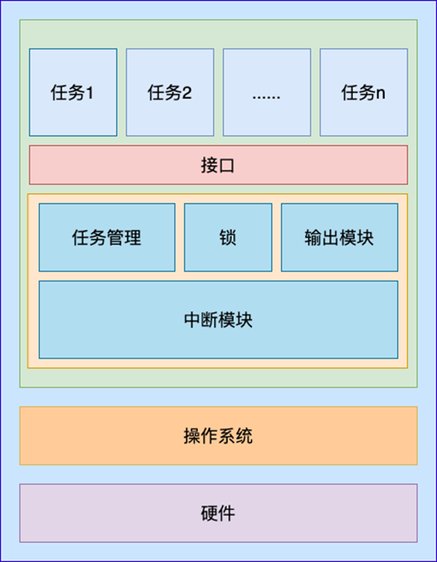
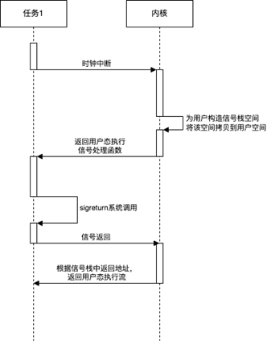
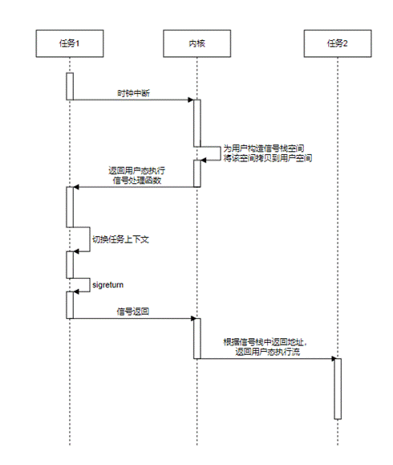
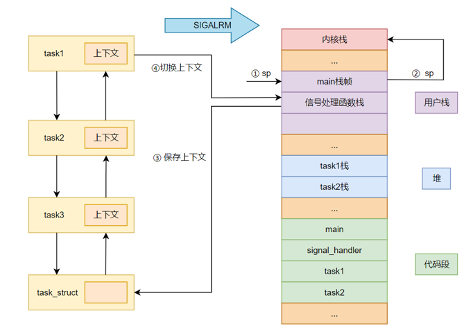
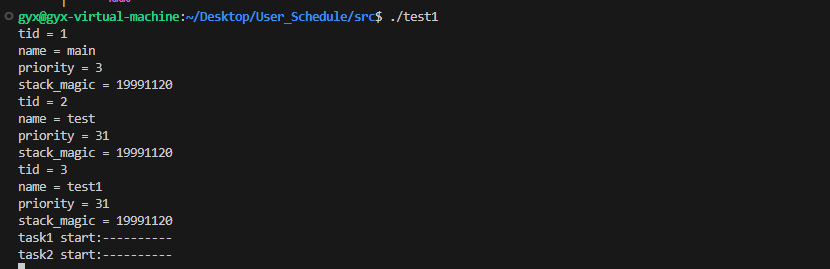

<div align="center"><h1><b><font size=7>proj317--efficient-user-level-threads-scheduling-and-mapping</font></b></h1></div>
<div align="center"><font size=5>2024 年全国大学生计算机系统能力大赛操作系统设计赛——功能赛道</font></div>
<div align="center"><font size=5>赛题选择：[proj317--efficient-user-level-threads-scheduling-and-mapping]</font></div>
<div align="center"><font size=5>队伍名称：大企鹅</font></div>
<div align="center"><font size=5>队员姓名：高怡香、王月妮、刘冰</font></div>
<div align="center"><font size=5>指导教师：陈莉君教授、谢瑞莲老师</font></div>
<div align="center"><font size=5>项目导师：任玉鑫、吴一凡</font></div>
<div align="center"><font size=5>学校名称：西安邮电大学</font></div>

---
[TOC]

## 项目简介 

项目名称：高效用户态线程调度

项目描述：在原生Linux中使用Linux线程来执行多个小的计算任务，由于原生Linux线程的调度是由Linux内核决定的，所以多个计算任务的切换会花费大量的切换时间。因此，通过本项目提出的高效用户态线程调度，让多个小任务尽可能的在一个进程（单线程进程）中执行，可以减少大量不必要的切换时间，并且能够更好的利用程序的局部性原理。所以提出一种Linux用户态下多任务的想法，对比目前的协程的优势和不足，设计出一个用户态抢占式的任务调度框架。希望达到如下目标：

-   支持用户态抢占式任务调度：多个任务之间的执行相互独立；
-   支持百万级的任务数量：能够支持大规模任务的执行；
-   支持多个调度策略：适应更多的应用场景。


## 项目进度

通过与陈莉君教授以及任玉鑫博士讨论并结合赛题，明确本项目的目标是实现一个用户态抢占式任务调度框架，打算从以下角度进行赛题的开展：

- 调研已有的用户态调度框架，分析其优缺点
- 确定项目的实现思路以及具体的方案

截止初赛, 本队项目完成进度如下:

| 任务编号 | 项目进度                                                     | 完成情况 |
| -------- | ------------------------------------------------------------ | -------- |
| 1        | 实现用户态抢占式任务调度框架                                 | 100%     |
| 2        | 利用Linux操作系统中信号机制可以打断用户态的执行流，实现任务执行流独立 | 100%     |
| 3        | 实现FIFO调度策略                                             | 100%     |
| 4        | 设计任务结构体task_struct，明确任务管理以链表的形式实现      | 100%     |
| 5        | 实现高精度定时器，用其产生信号来模拟中断，即调度的时机       | 100%     |
| 6        | 使用sigcontext结构体解决任务之间的上下文切换问题             | 100%     |
| 7        | 实现在多任务操作系统环境中模拟创建并运行不同类型的任务并统计任务执行时间 | 100%     |

截止决赛第一阶段, 本队项目完成进度如下:

| 任务编号  | 项目进度                                                         |完成情况|
| -------- | ------------------------------------------------------------ |-----------|
| 1        | 实现用户态抢占式任务调度框架     |                 100%         |
| 2        | 利用Linux操作系统中信号机制可以打断用户态的执行流，实现任务执行流独立    |100%         |
| 3        | 实现FIFO调度策略           |100%         |
| 4        | 设计任务结构体task_struct，明确任务管理以链表的形式实现 |100%         |
| 5        | 实现高精度定时器，用其产生信号来模拟中断，即调度的时机     |100%         |
| 6        | 使用sigcontext结构体解决任务之间的上下文切换问题 |100%         |
| 7        | 实现在多任务操作系统环境中模拟创建并运行不同类型的任务并统计任务执行时间    |100%         |
| 8       | 将User_Schedule应用在ROS2模型上 |100%|
| 9        | 优化现有任务调度和切换、任务计数利用eBPF在内核态完成，上下文切换利用信号在用户态完成|100%|
| 10        | 利用eBPF调度类在用户接口不变的基础上重构用户态任务调度     | 50%  |


##  决赛第二阶段预期目标

- 目前阻塞信号集功能，是基于内核模块实现的，内核模块实现并不安全，故经过调研，可以利用eBPF技术完美规避内核模块的不安全性，初步计划结合eBPF技术完成发送信号，阻塞信号集，目前并未集成到User_schedule中，作为扩展方向之一。

- 由于eBPF技术能够支持采集内核中的细粒度指标，通过 eBPF 采集系统当前的关键指标，对任务进行量化处理，通过一定的算法确定完成该任务的最优线程数，作为扩展方向之一。

- User_schedule 用户态抢占式调度框架已经应用在 ROS2 框架，利用User_schedule的调度框架实现对 ROS2 框架的多执行器部分进行优化处理，作为扩展方向之一。
 


​     

## 项目设计

### 用户态抢占式任务调度框架

本项目实现的用户态抢占式任务调度框架中，任务之间相互独立。设计的框架图如下所示。

<div align=center>

</div>


​                                                                           

为实现用户态抢占式的任务调度，需要在用户态进程中加入一个中断模块，该中断模块为每个任务提供抢占点。

使用该任务管理框架创建的任务需要在该任务管理框架中存在一个任务管理实体，并且该任务框里框架需要对每个任务管理实体进行统一管理，该部分的功能即为上图中的任务管理模块。

由于每个任务之间可能存在共享资源，则每个任务之间可能存在竞争关系，所以需要增加上图中的锁模块让每个任务更合理的使用共享资源。

由于进程的控制台等进程资源只有一个，所以同一时刻只能有一个任务使用控制台等进程资源，该项目目前已实现图中的输出管理模块，该模块即用来提供一个统一的接口供每个任务使用控制台资源。

该框架只提供有限的任务接口供用户使用，提供的接口组成上图中的接口层。用户态使用提供的接口创建任务后，每个任务是在同一个进程中运行的，即上图中表示的每个上层任务。


### 任务的独立性和可抢占

任务的独立性即任务的执行流相互独立，任务的切换在大多数时间为被动的。为此，需要为在用户态找到一个能够打断任务执行流的中断源，Linux操作系统中信号机制可以打断用户态的执行流，所以本项目选用信号作为中断源。Linux原信号处理时序图（简化）如下所示。

<div align=center>

</div>


​																					

图中简化了Linux信号处理的流程，将内容更聚焦在一个任务与内核之间的交互。传统的信号处理流程中，假设用户注册了一个用户态信号处理函数。当一个信号到来时，信号的响应首先发生在内核态。内核发现用户注册了一个用户态的信号处理函数，则需要为用户态信号处理函数构造一个用户栈空间，供用户态的信号处理函数使用。内核返回到用户态执行用户注册的信号处理函数，处理完成后，使用sigreturn系统调用，根据构造的栈空间返回内核执行，后续根据栈空间中指定的用户态返回地址返回用户空间继续执行后续操作。

在Linux原处理流程中，内核发现用户注册了用户态信号处理函数，所以为用户构造了一个用户态空间的栈，并且在执行sigreturn返回内核态后，根据该用户态的栈空间记录的返回地址，返回用户态原来的执行流继续执行。该过程中用户态的栈空间由于是在用户态空间，所以提供给信号处理函数一个时机去改变用户态任务的执行流。本项目使用该时机进行任务上下文的切换，任务切换的时序图如下图所示。

<div align=center>

</div>


利用信号处理函数可以修改信号栈的时机，在信号处理函数中修改信号返回用户正常执行流的返回地址，在信号处理函数执行sigreturn返回内核态后，内核根据修改后的信号返回地址返回用户态，实现任务之间的切换。时序图中所展示的任务切换不修改原Linux的信号处理流程，并且将每个任务的执行流相互独立。

### 任务上下文的确定

修改该结构体中的信号返回地址即可修改任务的执行流，得出将该结构作为任务上下文是可行的。本项目通过task_struct结构体管理任务，其中struct sigcontext处理信号保存和恢复进程上下文状态。

操作系统加载程序启动时，创建进程，设置栈指针sp指向用户栈的main()栈帧，接收到SIGALRM，产生信号中断，陷入内核，执行信号处理的回调函数signal_headler，在信号处理函数执行的时候，会保存当前进程的context于task_struct，通过调度算法选中下一个要执行的进程，将进程的上下文状态保存在task_struct，完成上下文切换，控制权由新进程掌控，信号处理函数执行完成之后，调用sigreturn 从用户空间返回内核空间，最终内核使用保存在内核栈中的上下文状态来恢复进程。如下图是任务切换的流程。

<div align=center>

</div>


### 任务调度测试

对用户态抢占式任务调度框架进行测试，模拟基于SIGALARM信号进行多任务调度场景，包括初始化主任务，创建任务，任务调度及任务退出，其设定主任务为阻塞态，当触发信号机制模拟中断时，调度其他任务，其测试结果如下：

<div align=center>

</div>


测试代码：

```c
#include "task.h"
#include "analog_interrupt.h"
#include <stdio.h>
#include <unistd.h>
#include <sys/time.h>
#include <pthread.h>

void test(void *args)
{
    printf("task1 start:----------\n");
   
    task_exit(current_task);
}

void test1(void *args)
{
    printf("task2 start:----------\n");
   
    task_exit(current_task);
}

int main()
{
    init();                          

    print_task_info(current_task);
    task_start("test", 31, test, NULL);
    task_start("test1", 31, test1, NULL);
    struct task_struct *ptask = tid2task(2);
    print_task_info(ptask);
    ptask = tid2task(3);
    print_task_info(ptask);
    interrupt_enable();

    while (1)
    {
        pause();
    }

    return 0;
}
```

## 阶段性收获

- 经过调研初步拟定了两种实现方案，方案一：使用一个用户态的操作系统去进行调度，但是难度过大且性能上面也不能做出保证；方案二：实现一个用户态抢占式任务调度框架。
- 拟定实现方案二，结合现有的协程框架的调研结果，并未找到可以解决各个任务执行性完全独立的方案，本项目打算在调度器schedule下模拟出中断层，使用该中断作为任务切换的基础。
- 通过signal模拟信号量产生中断的过程中，将理论转化为实践，收获很大。
- 在开发过程中，对linux内核中进程、线程、协程等方面知识有了从理论到实践的认识。
- 开发过程中需要考虑将功能模块（上下文切换、调度、信号处理等）进行分层化、模块化，方便后期进行移植。
- 对任务调度相关知识有了更深入的认识，用户态开发与内核态开发完全不同，用户态开发时无法直接使用内核的一些机制。


## 构建项目

User_schedule 使用详情请见[User_Schedule使用指南](https://gitlab.eduxiji.net/T202411664992702/project2210132-234653/-/blob/main/Docs/User_schedule%E5%B7%A5%E5%85%B7%E4%BD%BF%E7%94%A8%E6%8C%87%E5%8D%97.md)及[ROS2模型搭建](https://gitlab.eduxiji.net/T202411664992702/project2210132-234653/-/blob/main/Docs/ROS2%E6%A8%A1%E5%9E%8B%E6%90%AD%E5%BB%BA.md)

## 项目文档及架构

本项目整体开发架构及文档如下：
| 文档说明         | 链接                                                        |
| ------------- | ------------------------------------------------------------ |
| 技术方案| [技术方案](https://gitlab.eduxiji.net/T202411664992702/project2210132-234653/-/blob/main/Docs/%E6%8A%80%E6%9C%AF%E6%96%B9%E6%A1%88.md)                  |
| 初赛报告 | [初赛报告](https://gitlab.eduxiji.net/T202411664992702/project2210132-234653/-/blob/main/Docs/%E5%88%9D%E8%B5%9B%E6%8A%A5%E5%91%8A.md)                  |
| 决赛报告 | [决赛报告](https://gitlab.eduxiji.net/T202411664992702/project2210132-234653/-/blob/main/Docs/%E5%86%B3%E8%B5%9B%E6%8A%A5%E5%91%8A.md) |
| ROS2模型搭建 | [ROS2模型搭建](https://gitlab.eduxiji.net/T202411664992702/project2210132-234653/-/blob/main/Docs/ROS2%E6%A8%A1%E5%9E%8B%E6%90%AD%E5%BB%BA.md)                               |
| User_schedule 使用说明 | [User_schedule 使用说明](https://gitlab.eduxiji.net/T202411664992702/project2210132-234653/-/blob/main/Docs/User_schedule%E5%B7%A5%E5%85%B7%E4%BD%BF%E7%94%A8%E6%8C%87%E5%8D%97.md) |
| User_schedule 性能测试 | [User_schedule 性能测试](https://gitlab.eduxiji.net/T202411664992702/project2210132-234653/-/tree/main/User_Schedule/test_dir) |
| 会议记录| [会议记录](https://gitlab.eduxiji.net/T202411664992702/project2210132-234653/-/blob/main/Docs/%E4%BC%9A%E8%AE%AE%E8%AE%B0%E5%BD%95.md)        |
| openMP 学习 | [openMP 学习](https://gitlab.eduxiji.net/T202411664992702/project2210132-234653/-/tree/main/References/learning_docs)                                |
| 论文调研  |  [论文调研](https://gitlab.eduxiji.net/T202411664992702/project2210132-234653/-/tree/main/References)                   |                                   |


```sh
project2210132-234653
./
├── Docs 设计及使用文档
│   ├── images
│   ├── ROS2模型搭建.md
│   ├── User_Schedule工具使用指南.md
│   ├── 会议记录.md
│   ├── 技术方案.md
│   ├── 技术调研.md
│   └── 阶段性技术报告.md
├── README.md
├── References 参考文献及阅读笔记
│   ├── Callisto  Co-scheduling parallel runtime systems.pdf
│   ├── FJOS.pdf
│   ├── ghost.pdf
│   ├── images
│   ├── learning_docs
│   │   ├── images
│   │   └── openMP
│   │       ├── examples
│   │       │   ├── for.c
│   │       │   ├── for.trace
│   │       │   ├── norm_for.c
│   │       │   ├── norm_for.trace
│   │       │   ├── norm_section.c
│   │       │   ├── openMP基础学习.md
│   │       │   ├── section.c
│   │       │   ├── simd.cpp
│   │       │   └── 是否使用openMP的程序的差别.md
│   │       └── README.md
│   ├── NuPoCo_最大限度地利用系统利用并行管理的共定位并行应用程序.pdf
│   ├── Optimization.pdf
│   ├── Parcae A System for Flexible Parallel Execution.pdf
│   ├── ppOpen-AT动态确定线程数.pdf
│   ├── readNotes
│   │   ├── CallistoNote.md
│   │   ├── ForkJoin并行的实用、可预测和高效的系统支持.md
│   │   ├── ghost_readNote.md
│   │   ├── ROS2.md
│   │   ├── SyrupNote.md
│   │   ├── Thread Reinforcer_动态确定线程数.md
│   │   ├── 多线程数据流软件的优化.md
│   │   ├── 最大限度地利用系统利用并行管理的共定位并行应用程序.md
│   │   └── 通过使用ppOpen-AT改变OpenMP中的指令和线程数进行自动调优.md
│   ├── ROS2多线程执行器上DAG任务的优先级分配方法_纪东.pdf
│   ├── syrup.pdf
│   └── Thread_reinforcer.pdf
└── User_Schedule 项目实现
    ├── ROS2
    │   └── user_thread_scheduler
    │       └── src
    │           ├── build
    │           ├── CMakeLists.txt
    │           ├── device
    │           │   ├── console.c
    │           │   └── ioqueue.c
    │           ├── hook.c
    │           ├── include
    │           │   ├── analog_interrupt.h
    │           │   ├── assert.h
    │           │   ├── bitmap.h
    │           │   ├── console.h
    │           │   ├── debug.h
    │           │   ├── init.h
    │           │   ├── ioqueue.h
    │           │   ├── list.h
    │           │   ├── set_ticker.h
    │           │   ├── stdint.h
    │           │   ├── sync.h
    │           │   ├── task.h
    │           │   └── timer.h
    │           ├── interrupt
    │           │   ├── analog_interrupt.c
    │           │   └── timer.c
    │           ├── kernel
    │           │   ├── Makefile
    │           │   └── signal.c
    │           ├── lib
    │           │   ├── assert.c
    │           │   ├── bitmap.c
    │           │   └── list.c
    │           ├── libtask.a
    │           ├── lines.sh
    │           ├── main.c
    │           ├── makefile
    │           ├── package.xml
    │           ├── run.sh
    │           ├── schedule_main.c
    │           └── task
    │               ├── context_swap.asm
    │               ├── debug.c
    │               ├── died_context_swap.asm
    │               ├── get_reg.asm
    │               ├── init.c
    │               ├── sync.c
    │               └── task.c
    └── test_dir 测试目录
        ├── cpu_test
        │   ├── cpu_usage_data.txt
        │   ├── graph_cpu.py
        │   ├── openMP_cpu.py
        │   ├── pthread_cpu.py
        │   └── usched_cpu.py
        ├── cpu_usage_comparison.png
        ├── mm_info_compare.png
        ├── mm_test
        │   ├── filtered_process_info.txt
        │   ├── graph_mm.py
        │   └── mm.py
        └── test_code
            ├── openMP
            ├── openMP.c
            ├── pthread.c
            └── test

```

