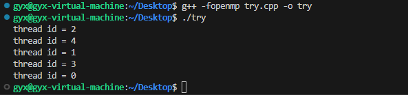

# OpenMP学习

## 一、OpenMP是什么

OpenMP 是一套支持跨平台的共享内存方式的多线程并发的编程 API

可以理解为，OpenMP 就是一套可以插入在代码中的工具，我们利用这些工具来实现一些多线程相关的功能。

`OpenMP` 的执行有以下这些特点：

- OpenMP 程序串行和并行区域交替出现
- 串行区域由 `master thread`（`thread 0`） 执行
- 并行区域由多个线程同一时间一起执行，不同线程一起完成并行区域中的任务

## 二、OpenMP语法

`OpenMP` 的语法包括以下三类：

- 线程相关的函数调用库
- 线程相关的编译指导语句
- 线程相关的环境变量

### 2.1 常用线程相关的函数调用库

`OpenMP` 的函数调用库可以用来进行一些进程相关的设置和信息获取。

- omp_set_num_threads(3),设置进程的线程数为 3（在此后的分支区，一共会有三个线程参与进行），其中设置得进程数也可以是变量。

  ```c++
  #include <iostream>
  #include <omp.h> // NEW ADD
  using namespace std;
  
  int main()
  {
      int x=5;
      omp_set_num_threads(x);
      #pragma omp parallel 
      {
      #pragma omp for
      for (int i = 0; i < 5; ++i) {
          printf("thread id = %d\n", omp_get_thread_num());
      }
      }
     
  } 
  ```

  

- omp_get_thread_num(); // 获取当前进程中的线程数

```c++
#include <iostream>
#include <omp.h> // NEW ADD

using namespace std;

int main()
{
omp_set_num_threads(4); // 设置进程的线程数为4
#pragma omp parallel 
{   // 并行区域-------------------------------
    double stime =omp_get_wtime();
    for (int i = 0; i < 3; ++i) {
        printf("thread id =  %d, start time = %f ---- now time: %f ------ run time:%f\n", omp_get_thread_num(), stime, omp_get_wtime(),omp_get_wtime() - stime);
    }
}   // 并行区域结束------------------------
        return 0;
} 


//omp_set_num_threads(); // 设置进程的线程数
//omp_get_thread_num();  // 获取当前线程的 id
//omp_get_wtime(); // 用于获取当前时间的双精度浮点数表示，以秒为单位
// omp_set_nested(1); // 设置允许嵌套并行
//omp_get_netsted(); // 获取当前程序是否允许嵌套并行
//omp_in_parallel(); // 当前程序是否在并行中，1 表示并行，0表示串行
//omp_get_mex_thread(); // 获取最多可以用于并行计算的线程数目
```


可以看到这些线程执行次序不一样，并行区域的每行代码会被4个线程重复执行。

### 2.2 线程相关的环境变量

- `OMP_NUM_THREADS`，它指明并行区域中最大的线程数目。
- `OMP_SCHEDULE`，它指明使用 `schedule(runtime)` 语句时将采取的调用策略，该语句将在下文介绍。
- `OMP_NESTED`，它指明是否允许 `OpenMP` 采取嵌套并行。

### 2.3 常用编译指导语句

在上面的代码中如`#pragma omp 指令 [子句1] [子句2] [...]`

- 指令：规定并指派线程相关的功能，这有点类似于“命令”
- 子句：配合指令，完善功能的细节，辅助指令达成线程相关的任务，这有点类似于“命令的参数”

#### 2.3.1 指令

**parallel**用在一个结构块之前，表示这段代码将被多个线程并行执行，并行区域中的代码将由所有线程各执行一次。

**for** 指令一般使用在并行域（外部嵌套有 `parallel`）中，其作用是让多个线程合作完成**同一个循环**。**for**和**parallel**可以一起连用，例如

```c++
#include <iostream>
#include <omp.h> // NEW ADD

using namespace std;

int main()
{
omp_set_num_threads(3);
#pragma omp parallel for 
    for (int i = 0; i < 3; ++i) {
        printf("thread id = %d\n", omp_get_thread_num());
    }
} 


#include <iostream>
#include <omp.h> // NEW ADD

using namespace std;

int main()
{
    omp_set_num_threads(3);
    #pragma omp parallel 
    {
    #pragma omp for
    for (int i = 0; i < 3; ++i) {
        printf("thread id = %d\n", omp_get_thread_num());
    }
    }
   
} 
```

可以看到打印的结果为


**sections**指令一般使用在并行域（外部嵌套有 `parallel`）中，并且可以和 `parallel` 连用，成为 `parallel sections`

`sections` 的作用是划定一块代码区域，在代码区域内指定 `section` 代码块，不同的线程将会执行不同的代码块（每个代码块只会被一个线程执行），通过这种方式来指导线程进行分工。

```c++
#include <iostream>
#include <omp.h> // NEW ADD

using namespace std;

int main()
{
    omp_set_num_threads(3);
    #pragma omp parallel sections 
{
    #pragma omp section 
    {
        for (int i = 0; i < 3; ++i) {
            printf("============this is thread %d and section 1\n", omp_get_thread_num());
        }
    }
    #pragma omp section 
    {
        for (int i = 0; i < 3; ++i) {
            printf("------------this is thread %d and section 2\n", omp_get_thread_num());
        }
    }
    #pragma omp section 
    {
        for (int i = 0; i < 3; ++i) {
            printf("```````````this is thread %d and section 3\n", omp_get_thread_num());
        }
    }
}
   
} 
```


**single** 表示一段只被单个线程执行的代码，使用 `single` 时执行这段代码的线程不一定是 `master` （编号为 $0$）线程，而是第一个到达 `single` 语句的线程，具有一定随机性；而使用 `master` 时执行这段代码的线程一定是 `master` 线程

```c++
#include <iostream>
#include <omp.h> // NEW ADD

using namespace std;

int main()
{
    omp_set_num_threads(3);
   #pragma omp parallel
{
#pragma omp for
        for (int i = 0; i < 3; ++i) {
            printf("this is for thread %d\n", omp_get_thread_num());
        }
#pragma omp master
        for (int i = 0; i < 3; ++i) {
            printf("master %d\n run", omp_get_thread_num());
        }
#pragma omp single
        for (int i = 0; i < 3; ++i) {
            printf("the only thread to run single is %d\n", omp_get_thread_num());
        }
}
   
} 
```


**barrier**用于并行域内代码的线程同步，线程执行到 `barrier` 时要停下等待，直到所有线程都执行到 `barrier` 时才继续往下执行

```c++
#include <iostream>
#include <omp.h> // NEW ADD

using namespace std;

int main()
{
    omp_set_num_threads(3);
 #pragma omp parallel
{
    printf("thread id = %d\n", omp_get_thread_num());
#pragma omp barrier
    printf("thread %d cross barrier\n", omp_get_thread_num());
}
   
} 
```


**atomic** 指令：用于指定一个数据操作需要原子性地完成。即保证内存中的共享存储变量在某时刻只被同一线程修改

```c++
#include <iostream>
#include <omp.h> // NEW ADD

using namespace std;

int main()
{
    omp_set_num_threads(3);
	int a = 3;
	//share子句：用于声明变量列表中的所有变量都是进程公共的，即实现3个进程都能修改同一个变量a
 #pragma omp parallel shared(a)
{
    #pragma omp atomic
    ++a;
    printf("thread %d : ++a is %d\n", omp_get_thread_num(), a);
}
   
} 
```


**critical** 指令： 用在一段代码临界区之前，保证每次只有一个 `OpenMP` 线程进入，即保证程序的特定区域一次（时刻）只有一个线程执行

**critical** 和 **atomic** 区别：`atomic` 只作用于单个数据操作，而 `critical` 作用域是一段代码块

```c++
#include <iostream>
#include <omp.h> // NEW ADD

using namespace std;

int main()
{
    omp_set_num_threads(3);
	int a = 0,i;
	//share子句：用于声明变量列表中的所有变量都是进程公共的，即实现3个进程都能修改同一个变量a
#pragma omp parallel shared(a)
{
    #pragma omp critical //同一时刻只有一个线程可以进去
    {
		int a = 0;
		for(int i=0;i<=100;i++) a+=i;
        printf("thread %d : sum is %d\n", omp_get_thread_num(), a);
    }
}
  
} 
```


#### 2.3.2 编译指导语句的子句

**if子句** ：`if(val)` 子句能够通过 `val` 的值来指定并行区域内的代码是应该并行执行还是串行执行（非零值：并行）

```c++
#include <iostream>
#include <omp.h> // NEW ADD

using namespace std;
void test(int val){
    
     #pragma omp parallel if (val) 
     {
        int a = 0;
        if(omp_in_parallel()){
            for(int i=1;i<=100;i++) a+=i;
            printf("this is parallel! sum = %d , thread id = %d\n",a,omp_get_thread_num());
        }else{
            printf("this is not parallel! thread id = %d\n",omp_get_thread_num());
        }
     }
}
int main( ) {
    omp_set_num_threads(2);
    test(0);
    test(1);
}
```


**private子句** ： 该子句声明列表中的所有变量都是进程私有的（变量列表列举在尾随圆括号中），声明成线程私有变量以后，每个线程都有一个该变量的副本，这些副本可以有不相同的值，并且线程之间对这些值的操作不会互相影响。

```c++
#include <iostream>
#include <omp.h> // NEW ADD

using namespace std;

int main()
{
    omp_set_num_threads(3);
    int a = 3;
    #pragma omp parallel private(a) 
    {
        printf("a is %d", a);
        a++;
        #pragma omp for 
        
            for (int i = 1; i <= 3; i++) {
                printf("\nthread  id = %d and a is %d\n", omp_get_thread_num(), a);
            }
    }
  
} 
```


**firstprivate子句** ：功能和private类似，在上个代码中，并行区域内a的初始值被设定为0，但firstprivate会把a的初始值设定为并行区域外的值


**`reduction` 子句** ：

- 在每个线程为全局的原始变量创建属性为 `private` 的线程局部变量副本
- 将各个线程的局部变量副本进行指定的操作，并将操作后的结果返回全局的原始变量

`reduction` 子句的语法结构是这样的：`reduction(操作符 : 进行该操作的变量列表)`

```c++
#include <iostream>
#include <omp.h> // NEW ADD

using namespace std;

int main()
{
    omp_set_num_threads(3);
   int a = 2;
    #pragma omp parallel reduction(+ : a) 
    {
       printf("at 11, a is %d\n", a);
        a = 4;
        #pragma omp for 
            for (int i = 1; i <= 3; i++) {
                a += i;
                printf("hhh, here is thread %d, a is %d and i is %d\n", omp_get_thread_num(), a, i);
            }
        
    }
    printf("at last, a is %d\n", a);
  
} 
```


**ordered子句** ：是指定 `for` 循环必须按照正常的顺序执行

```c++
#include <iostream>
#include <omp.h> // NEW ADD

using namespace std;

int main()
{
    omp_set_num_threads(3);
   int a = 2;
    #pragma omp parallel for ordered
    
        for (int i = 0; i < 10; ++i) {
            printf("%d ", i);
        }
    printf("\n");
    #pragma omp parallel for 
    
        for (int i = 0; i < 10; ++i) {
            printf("%d -", i);
        }
  
} 
```


**`num_threads` 子句** :等同函数 `omp_set_num_threads(cnt)`

```c++
#include <iostream>
#include <omp.h> // NEW ADD

using namespace std;

int main()
{

#pragma omp parallel  num_threads(4) // NEW ADD
 printf("%d ",omp_get_num_threads());
 return 0;
}
```

**`schedule` 子句** :描述如何将循环任务划分给一组线程，包含四种策略，其语法规则为`schedule(strategy, chunk_size)`

- `static`:`static` 划分策略会将循环任务分成多个块，块的大小 `chunk_size` 由程序员指定，然后**按循环顺序**将各个块**静态地**分配给各线程，即**在执行前就指派好每个线程完成对应的块**。
- `dynamic`:`dynamic` : 划分策略会将循环任务分成多个块，块的大小 `chunk_size` 由程序员指定，各线程**完成对应的块后会申请执行新的块**。即在执行前并不固定哪个线程执行哪个块，而是在每个线程完成手头工作后，当即为其指派一个新的块任务。
- `guided`：`guided` 划分策略采用指导性的启发式自调度方法，开始时每个线程会分配到较大的迭代块，之后分配到的迭代块会逐渐递减。迭代块的大小会按指数级下降到指定的块大小，这个指定的最小块 `chunk_size` 可以由程序员自行指定。
- `runtime`：`runtime` 表示根据环境变量值 `OMP_SCHEDULE` （默认为 `static`）确定上述调度策略中的某一种。
