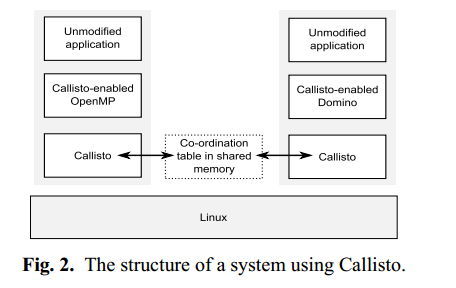
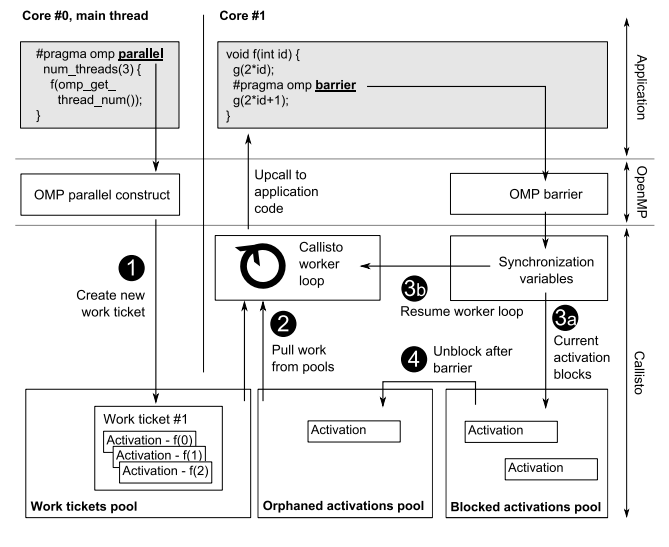

# Callisto: Co-Scheduling Parallel Runtime Systems

在同一台机器上同时运行多个并行应用程序变得越来越重要，但是，当性能很差的时候，程序不能很好地适应动态变化的内核数量，并发作业被调度的时间可能相差很大。本文介绍了并行运行时系统的资若源管理层——Callisto。我们描述了Callisto和两个支持Callisto的并行运行时系统的实现——一个用于OpenMP，另一个用于任务并行编程模型。

## Callisto是什么



​	在这个原型中，`Callisto`是一个用户模式共享库，它连接不同版本并行运行时系统。他们之间通过共享内存进行交互，以协同控制硬件上下文的使用。这些并行运行时系统需要适应于Callisto。并且，在这些并行运行时系统上构建的应用程序可以不加修改地运行，并且不需要更改操作系统。在这个原型当中，有两个启用Callisto的运行时系统：OpenMP和Domino（这是一种细粒度任务并行系统）

​	**Callisto采用的主要技术——动态空间调度，将控制传递给并行运行时系统的向上调用接口，运行时系统表达其可用并行工作的机制和用于等待的统一同步机制**。

## 动态空间调度

运行时系统通过共享内存中的表来声明硬件上下文，当其他作业开始或结束以及可用工作量发生变化时来动态调整自己的需求。我们在作业之间动态地切换硬件上下文。当所有作业都可运行时，每个作业都有固定的cpu部分，但可以在可用时使用其他空闲的硬件上下文。

空间调度策略的定义是：当所有作业都可运行时，哪些作业应该使用哪些硬件上下文。空间调度策略为单个作业的每个硬件上下文赋予了高优先级。这定义了那些（CPU受限）的作业的系统状态，并允许我们探索分配策略，例如是否将给定核心中的所有h/w上下文分配给相同的作业

下面是一个OpenMP的例子，在一个主线程中创建了3个线程来并行执行，并且每一个线程当中都有个 `#pragma omp barrier`




对于`Callisto`，这个例子是通过`OpenMP`运行时系统为并行区域(步骤1)创建一个`Work ticket`来实现的， 这个`Work ticket`在每一个线程当中都会被调用。`Callisto`中有一个`worker`来捕获这些被调用的`Work ticket`，分配一个堆栈来使用，并且执行此调用，从而遇到`f` 中的`barrier` 。当阻塞时，部分执行的工作被放入阻塞激活池中，具有相同的工作线程可以切换到新的堆栈并拾取新工作，直到对`f`的所有调用都到达了`barrier`，阻塞的激活就可以重新运行，并且由`Callisto worker` 捕获并完成向上调用。

## Callisto如何管理并行工作

```c
#pragma omp parallel for schedule(dynamic,100)     //pragma指示迭代可以并行运行，并且线程应该通过动态声明100个迭代
for (int i = 0; i < 1000000; i++) {
arr[i] *= 2;
}
printf("Done\n");

// Start-of-day
Worker[] CreateWorkers();		//在开始时用于初始化worker
// Managing work
uint64_t CreateWorkTicket(void *data,int max_concurrency);	//workticket表示并行工作的来源，data指向要激活的workticket,max_concurrency表示示最大并发数，在OpenMP中依赖OMP_NUM_THREADS环境变量
//work ticket有三种状态，active drained complete
void SetTicketDrained(uint64_t ticket);//设置状态为drained,在最后一次迭代调用前调用这个函数
void WaitTicketDrained(uint64_t ticket);
void WaitTicketComplete(uint64_t ticket);//主线程在打印“Done”之前调用WaitTicketComplete。
(a) Callisto提供的接口
    
void Activate(Worker *w, void *data,uint64_t ticket);//激活work ticket的一部分，Callisto worker会向上调用运行时系统的Activate函数，识别向上调用启动的工作线程等信息
(b) Operations implemented by a Callisto-enabled runtime system.
    
bool ShouldYield();
void YieldPoint();
(c) 协调并行运行系统之间的工作
    //Activate 与空间调度算法合作,当被调用时，激活处理程序应该在运行时系统中执行工作，并通过调用shouldyfield定期检入
```

从概念上讲，每个job对于机器中的每个硬件上下文都有一个worker。在动态空间调度策略下，实际运行的工作线程数量将随时间变化。将worker固定在硬件上下文中，而不是让它们在机器内迁移，使运行时系统能够缓存有关机器物理结构的信息(例如，哪些worker位于同一核心上)，并使用该信息构建SNZI树等数据结构，SNZI树可以在不加锁的情况下实现高效的并发读操作。

## OpenMP运行时系统

我们简要描述了我们解决的两个挑战：第一，避免不必要的barrier，第二，减少静态调度循环中的负载不平衡。然后我们总结实现细节。我们不需要对编译器或OpenMP应用程序进行任何更改。

### 在循环末尾使用barrier

```c
#pragma omp parallel for
for (int i = 0; i < 1000000; i++) { ... }
#pragma omp parallel for
for (int i = 0; i < 1000000; i++) { ... }

```

我们通过将OpenMP线程的概念与碰巧执行代码片段的特定工作线程解耦来解决这个问题。每个OpenMP并行段都映射到一个Callisto work ticket，最大并发性设置为要使用的OpenMP线程数。每次激活选择下一个OpenMP线程，将当前软件线程的activation-local设置为OpenMP线程的activation-local，并执行分配给该线程的迭代。

因此，多个OpenMP线程可以在一个软件线程上进行多路复用。OpenMP线程之间的切换是在用户模式下进行的，通常是当先前的线程阻塞在barrier时，worker启动新的激活。

### 改善负载平衡

OpenMP向应用程序公开了正在使用的线程数量，并且OpenMP API提供了关于线程如何分配工作的规则（static、dynamic、guided、runtime）;实现以特别的方式改变这一点是不正确的。此外，我们必须避免引入负载不平衡。

```
#pragma omp parallel for schedule(static)
for (int i = 0; i < 1000000; i++) { ... }
```

上面这个例子，采用的是静态调度，静态子句表明循环应该在线程之间划分为相等的批次。静态调度很常见，因为它在许多实现中开销很低;当线程数量固定，并且每次循环迭代中的工作是恒定的时，它是合适的。这里的问题是，在较小数量的硬件上下文上复用OpenMP线程可能会导致负载不平衡。

OpenMP线程池中的线程将由Callisto工作线程根据运行的工作线程数量和每批迭代的持续时间动态执行。将静态调度的循环更改为相对粗粒度的动态调度循环。

## Domino运行时系统

它提供了基于任务的编程模型的实现。该模型基于细粒度任务的并行执行，Domino基于我们现有的CDDP编程模型的实现。Domino使用触发器机制来触发任务的生成，当一个任务写入一个内存位置时，如果这个位置带有触发器，那么这个写操作将会触发生成一个或多个任务。这可以用来约束某些任务的执行。

## 小结

论文提出了一个叫做Callisto并行运行时系统的资源管理层，通过协调多个并行运行时系统来提高整体系统的性能和效率。通过将来自不同并行运行时系统的任务进行协同调度来提高系统的性能。


这篇文章引入了一个叫做Callisto并行运行时系统的资源管理层，通过将来自不同并行运行时系统的任务进行协同调度来提高系统的性能。之所以引入这个管理层，是因为当性能很差的时候，在同一台机器上同时运行多个并行应用程序，这些程序不能很好地适应动态变化的内核数量，并发作业被调度的时间可能相差很大。它连接不同版本并行运行时系统。他们之间通过共享内存进行交互，以协同控制硬件上下文资源的使用，它采用的主要技术是动态空间调度技术，并且文中给了一个OpenMP运行时系统应用的例子，让我对于这个callisto的一个原型有进一步了解。但对于这个技术的了解我还需要一点时间。