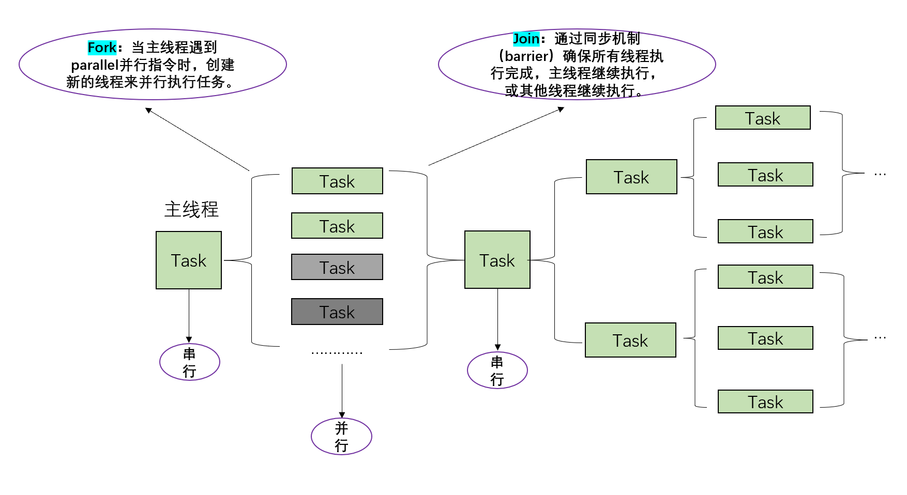

# Practical, Predictable, and Efficient System Support for Fork/Join Parallelism

## 本文主要贡献：

​		提出FJOS（支持可预测和高效的fork/join、任务内并行），跨套接字通信：链——线程——内核的分配，相比于传统fork/join模式系统利用率可增加三倍以上。

1、通过增加系统开销增加响应时间分析。

2、开销感知分配算法将任务合理地分配给处理器核心进行计算。

### fork/join模型：



fork()：创建新的进程并将task存放于当前线程的工作队列，fork/join框架根据当前执行任务的线程状态，决定让当前task处于工作队列等待状态/fork新的线程/唤醒其他正在等待task的线程。

join()：当前线程处于阻塞状态，其子任务完成/子任务处于等待队列。

总结：fork()前主线程执行，fork()创建并发执行的线程子任务，主线程可能会等待所有子任务完成后再继续执行调用join()执行，采用这种模式使得多核处理器可以真正并行地执行多个进程/线程。

### FJOS:

```c
#include <iostream>
#include <omp.h>   // NEW ADD
using namespace std;//openmp库，并行编程
int main()
{
        #pragma omp parallel for num_threads(4) // NEW ADD
        for(int i=0; i<10; i++)
        {
        cout << i << endl;
        }
        return 0;
}
```

测试：并行测试：

```c
#include <iostream>
#include <omp.h>
using namespace std;

int main()
{
  double start_time = omp_get_wtime(); // 记录并行区域之前的时间
  #pragma omp parallel for num_threads(4)
  for(int i=0; i<10; i++)
  {
​    cout << "Thread " << omp_get_thread_num() << " processing iteration " << i << endl;
  }
  double end_time = omp_get_wtime(); // 记录并行区域之后的时间
  // 计算并输出并行区域的运行时间
  cout << "Time taken for parallel region: " << end_time - start_time << " seconds" << endl;
  
  return 0;
}
```

串行测试：

```c
#include <iostream>
#include <chrono> 
using namespace std;

int main()
{
  // 获取开始时间
  auto start = chrono::high_resolution_clock::now();
  for(int i = 0; i < 10; i++)
  {
​    cout << i << endl;
  }
  // 获取结束时间
  auto finish = chrono::high_resolution_clock::now();
  // 计算运行时间
  chrono::duration<double> elapsed = finish - start;
  cout << "Elapsed time: " << elapsed.count() << " seconds\n";
  
  return 0;
}
```

​		不同的循环迭代生成闭包，并生成代码来调用并行运行，在运行时线程之间分配计算。通过这种方式，OPENMP程序在顺序执行阶段(for之前)和并行执行阶段(for语句的内容)完成之间切换；在分叉fork和连接join并行线程这种模式使得程序的执行效率得以提高。

## 增加系统开销

​		增加系统开销：RTA通过分析任务的各个阶段来计算整个任务的响应时间，对系统响应时间分析进行修改。**将fork/join的系统开销集成到系统响应时间，加入到并行组中聚合链的计算中**，并进行了优化处理，通过记录关键阶段的关键串行和关键核心的干扰，减少高优先级任务的冗余干扰。

## 开销感知分配算法

​		开销感知分配算法：阻止任务共享内核，将任务映射到不同的线程或处理器核心，决定任务优先级，**将高层级别任务分配给内核线程，采用最差拟合方法分配任务链**，优化任务的分配和调度，以最小化任务之间的干扰，考虑fork/join系统开销，更有效地分配任务并提高硬实时并行系统的可调度性。

核心思想：

（1）截止时间单调策略。将任务的优先级分配给所有子任务，子任务共享任务优先级，降低系统开销。

（2）将任务按照优先级从高到低排序，最高优先级任务首先执行。最大程度减小高优先级任务在多核之间传播干扰。

（3）确定第一个未分配任务所需最小核数N。

（4）确定提供N个核所需最小插槽数S。

（5）确定系统是否可以调度。最小核数>系统总核数，不可调度，反之，可调度（选择利用率最高的插槽，将核心分配到到数组中。）

（6）轮询策略分配，从任务的第一个阶段开始，使用循环轮询策略确保公平分配。将strands均匀分配到不同核心。

（7）响应时间分析（RTA）方法，确保任务在分配后的系统中是可调度的。

（8）调度失败，增加核数、重新计算并分配，当N增加到超过套接字中的内核数时，采用跨套接字进行分配。

## 实验与总结：

​		通过五种系统配置进行测试，包括使用自旋、阻塞的FJOS，以及在LinuxRT和Linux上使用GOMP的不同配置。了解OPENMP框架的底层开销，得出结论。

（1）FJOS的开销都明显低于GOMP——在40核时，最坏情况的开销分别小2.5倍和5倍。

（2）当任务处于套接字边界时，尽管有上下文切换和多处理器系统中的处理器间中断开销，但是FJOS中的阻塞与GOMP的旋转实现是竞争的。

（3）开销感知分配算法将随机任务集的系统利用率提高了现有RTA的3倍以上。

​	FJOS在处理需要核心较高利用率的任务时，比较受用。


