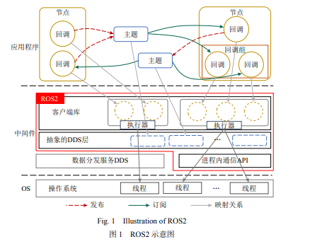
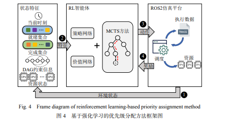

# ROS2 多线程执行器上 DAG 任务的优先级分配方法

## 一、来源

东北大学博士论文  2023年 作者：纪东

## 二、背景

在机器人系统中，任务通常具有复杂的依赖关系，并且需要实时处理。ROS2（Robot Operating System 2）提供了多线程执行器来处理并行任务。 在 ROS 中，任务执行的顺序取决于底层任务调度策略和分配给任务的优先级，从而来最大限度地缩短所有任务的执行时间。如何在DAG（有向无环图）结构中有效地分配任务优先级，以优化系统性能，是一个关键问题

### 2.1 ROS2 体系结构

如下图展示了 ROS2 的体系结构，在ROS2中，任务可以表示为DAG，其中节点表示任务，边表示任务之间的依赖关系。多线程执行器负责调度这些任务，以提高系统的并发性和实时性

- 节点是发布和接收消息的主体，使用发布—订阅范例相互通信
  - 节点在主题上发布消息，通过通信层数据分发服务 DDS 将消息广播给订阅主题的节点. 节点通过激活回调来处理 每个消息，从而对传入消息做出反应
- ROS2 中的执行器用于协调操作系统 进程中节点回调的执行
- 执行器维护一个就绪集合 Ω，它记录了可以执行的就绪回调. 执行器可以选择 Ω 中的就绪回调进行执行

### 2.2 挑战

- 实时性要求：任务需要在严格的时间约束内完成。
- 资源竞争：多线程执行器需要有效地利用系统资源，避免资源争夺
- 任务依赖：任务之间存在依赖关系，必须按顺序执行

## 三、解决方法

### 3.1 解决问题

本文旨在研究 ROS2 多线程执行器上运行的以有向无环图（directed acyclic graph，DAG）为特征的并行任务的执行行为，通过配置任务内结点的调度顺序，降低 ROS2 上应用程序执行时间

受强化学习在解决各种组合优化问题的最新研究成果的启发，在考虑 ROS2 多线程执行器的调度机制和执行约束的前提下，提出了一种基于强化学习的任务优先级分配方法，该方法提取了基于有向无环图形式表示的任务集的时间和结构特征，通过策略梯度和蒙特卡洛树搜索（Monte Carlo tree search, MCTS）方法有效地学习 ROS2 调度策略并给出合理的优先级设置方案，最终达到最小化并行任务的最大完工时间的目的

### 3.2马尔可夫决策过程(MDP)

一般来说，MDP 具有一组状态、一组动作、奖励函数和状态转移概率

- 状态：本文方法封装了当前时刻 t 、核的工作状态以及回调间的互斥约束关系。为了通过顺 序选择来调度 DAG 任务，状态还需要处于该状态下满足当前 依赖关系的就绪回调集合 Ω 和已经执行完的回调集合。
- 动作：动作行为表示时刻 t 在就绪集合 Ω 中选择一个回调进行执行。换句话说是在每个状态下可以执行的操作集合。本文将拥有N个回调程序的动作，选择操作 a 编码为一个离散空间 {0, 1, …, N}，当 a = m 时表示选择第 m 个回调，如果满足约束条件，则 将回调挂载到空闲核上，此动作并不占用实际的执行时间. 如果 a=0 ，则表示对挂载的回调进行处理， 将占用核上资源并产生执行时间。
- 奖励：为了学习得到最合理的优先级配置，以 最小化 DAG 工作流完成时间作为最优策略奖励参数.
- 转移概率： 从一个状态转移到另一个状态的概率，在 MDP 中，过渡状态是确定性的，这在ROS2中由DAG的依赖关系决定

### 3.3 蒙特卡洛树搜索(MCTS)

MCTS 是一种最佳优先搜索算法，基于随机模拟和决策树。用于在围棋中找到好的决策，但也可用于不同的 MDP，如集群资源调度。使用 MCTS 可以有效地搜索决策的空间，MCTS 由 4 个部分组成：选择、扩展、模拟和回溯.

- 选择：从根节点开始，递归地选择最优子节点，直到到达叶节点。

- 扩展：在叶节点处扩展一个或多个子节点。

- 模拟：从新扩展的节点进行随机模拟，直到达到终止状态。

- 回溯：将模拟结果沿路径回传

在ROS2中，将DAG中的每个任务表示为决策树中的一个节点，初始状态为所有任务未执行的状态，终止状态为所有任务执行完毕的状态

首先，从根节点（初始状态）开始，基于某种策略选择最优子节点，递归进行，直到到达叶节点。在选择过程中考虑任务的依赖关系和当前系统状态。并且，在叶节点处扩展新的子节点，代表当前任务完成后的新状态，只扩展可执行的任务，即那些所有依赖任务都已完成的任务，接着，从新扩展的节点开始，进行随机任务执行模拟，直到达到终止状态，模拟过程中记录每个状态下的任务执行顺序。此时将模拟结果（总执行时间）沿路径回传，根据树的搜索结果，为每个任务分配优先级，使得整体任务调度最优。

## 四、验证方法

通过生成随机任务集和使用离散事件模拟器模拟多线程执行器的执行来评估本文设计的方法

### 4.1 实验设置

- 一个基于 ROS2 执行策略的 gym  调度模拟器。该模拟器可以模拟 M 个同构处理器的 ROS2 系统执行行为，并精确计算每个 DAG 任务按 给定优先级顺序下的最大完工时间. 回调序列和执 行器的设置参数被输入至模拟器，以模拟 ROS2 处理 平台如何执行回调。
- 设计一组具有复杂依赖关系的DAG任务

### 4.2 基准比较

本文通过模拟器环境测量了各个调度方法的最长完工时间并将其用作 评估指标. 比较的方法有

- 随机方法：在每个调度决策点上随机选择一个可执行的任务进行执行，而不考虑任务的具体属性或系统状态
- 短任务优先方法：在调度决策点上优先选择执行估计执行时间最短的任务。
- 没有 PPO 的 MCTS：:PPO是一种强化学习算法，可以用来学习一个任务调度策略，通过反复训练优化该策略，使其能够在不同状态下选择最优的任务进行执行。MCTS通过随机模拟和树结构搜索，在每个状态下选择最优的动作，逐步构建并优化任务调度策略。

## 五、结论

本文提出了一种基于强化学习和 MCTS 的 在 ROS2 调度机制下的优先级配置方法，即设计回调的执行顺序。通过有效的任务调度，能够最小化总执行时间。并且通过模拟实验证明，在ROS2多线程执行器上处理DAG任务时，比基准测试方法更具优势，且随着回调数 N 和核数 M 的增加效果更加明显。