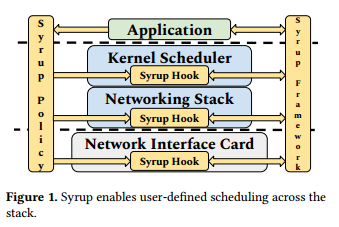
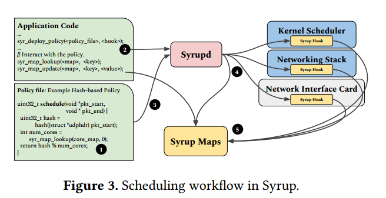
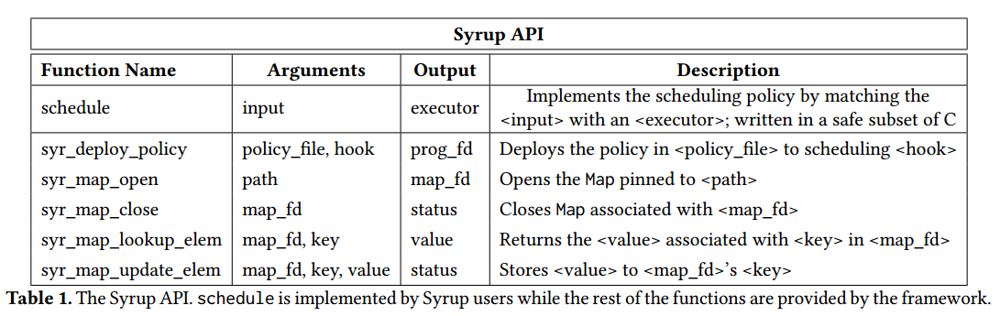
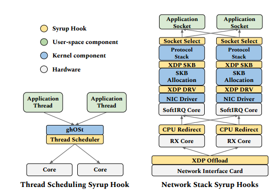

## 背景

传统的操作系统提供了一些默认的调度策略，但这些策略可能不总是满足所有应用程序的需求。每个应用程序使用的调度策略对其性能至关重要；**不同的应用程序和工作负载在不同的策略下表现最佳。将调度策略与应用程序特征相匹配可以减少或消除诸如排队阻塞、缺乏工作守恒、优先级反转以及缺乏调度程序可扩展性等问题**。考虑到广泛的算法、调优参数和实现选项，使用通用调度策略与特定于应用程序的调度策略之间的性能差异通常是一个或更多数量级。然而，调度策略通常被纳入大多数系统的设计中。应用程序被迫在系统层之间使用默认策略，这通常不是最优的。例如，复杂的Linux调度器及其完全公平调度器(complete Fair scheduler, CFS)策略被发现对重要的应用程序类不节省工作。

## 本文提出的解决方法

本文提到，应用程序开发人员不应该为每个应用程序类构建新的运行时或操作系统，而应该指定他们首选的调度策略，并将其安全地部署到现有系统中。整个系统堆栈中的调度器应该考虑应用程序首选项，以便针对特定于工作负载的模式进行优化。

Syrup提供了一种方式，让用户能够自定义调度策略，这个调度策略可以跨系统层并表达特定于应用程序，以满足特定应用程序或工作负载的需求。如图所示，应用程序开发人员可以使用Syrup在堆栈的各个层 (包括内核网络堆栈、内核调度器和可编程网络设备) 之间定义和安全地部署任意调度策略。**通过将调度视为匹配问题，调度策略表示为输入和处理输入的执行程序之间的匹配函数。从而使指定调度策略变得容易**。应用程序开发人员使用Syrup编写调度策略，来匹配输入（包括网络数据包、网络连接和内核线程）和处理输入执行程序（网卡队列、内核和网络套接字），并在不修改代码的情况下跨系统层部署它。

Syrup引入了系统钩子，以便在广泛使用的软件和硬件堆栈的不同层之间有效地部署策略。Syrup还允许在不同系统层运行的调度策略之间使用Map抽象进行通信，并保证应用程序间的隔离，确保策略只处理属于部署它们的应用程序的输入。

Syrup为三个后端提供钩子:eBPF软件、eBPF硬件和ghOSt。eBPF软件用于在内核网络堆栈的各种钩子上安全地部署匹配的函数，而eBPF硬件允许Syrup利用可编程网络设备。**ghOSt用于将线程调度分发给在用户空间中运行的匹配函数**。

## 调度工作流

- 首先，想要使用Syrup的应用程序的开发人员或管理员通过在单独的文件中实现一个简单的C接口来指定他们想要的调度策略。在§3.2中，我们描述了Syrup是如何为调度采用匹配抽象的，它允许开发人员以近乎声明的方式指定策略。

- 然后，应用程序代码调用sy_deploy_ policy函数，该函数接受两个参数：描述所需调度策略的文件（即上述开发人员编写的C接口）和该调度策略的一个或多个目标部署挂钩。sy_deploy_ policy函数与系统范围的守护进程syrupd通信，syrupd负责策略部署的所有工作。

- 接着，这个守护进程将策略文件编译成二进制文件或对象文件，并将其部署到用户指定的钩子中。

- 用户空间应用程序和部署在不同钩子上的Syrup策略可以选择性地通信，比如负载、延迟统计信息，或者使用键值存储式Map抽象(类似于键值存储)的预期完成时间。

- 映射在策略文件中定义，并在部署时由syrupd设置。应用程序可以在运行时随时更新或部署新策略。如果没有部署任何Syrup策略，应用程序将使用底层运行时和操作系统的默认调度策略运行。

在线匹配将调度分解为一系列“小”决策，提高了复杂策略的可组合性和可理解性。将调度实现为每个应用程序在线匹配还提供了可靠性和隔离优势。Syrup确保每个策略只处理属于部署它的应用程序的输入。性能不佳或有错误的策略只会影响部署它的应用程序，从而提高整个系统范围策略的可靠性。

调度函数返回值得类型是uint32_ t，而不是一个实际的执行者对象。返回值是syrupd在部署时设置的特定于应用程序和钩子的Map的键。这个Map保存了一组可用的执行程序

## Syrup的实现

**要启用用户定义调度，我们必须在内核和硬件中安全地部署用户代码，或者将调度决策转移到用户空间**。Syrup的实现通过使用两个最近开发的框架eBPF和ghOSt来支持这两种方法。我们使用eBPF在Linux网络堆栈和可编程网卡上安全地部署策略，并**使用ghOSt将内核线程调度转移给用户空间代理**。

eBPF程序使用系统调用加载到内核中，附加到特定的代码路径，并由事件触发。在Syrup中，我们使用eBPF  Map，它可以保存不同的执行器，eBPF Map是内核数据结构，可以存储任意值，并且可以固定到sysfs，以便多个程序可以访问它们。然而，eBPF对内核线程调度的支持还不是很成熟。内核调度器子系统中只有很少的eBPF钩子，而且它们中的大多数都与可观察性有关，而不是决策。因此，我们选择使用ghOSt将线程调度转移到用户空间。线程调度的粗粒度允许我们这样做。

ghOSt是一种新的Linux内核调度器，它实现了集中式调度，并且具有易于使用的API来实现新的集中式策略。ghOSt允许在单个自旋用户空间线程中实现策略，以减少开发和调试开销

## 如何使用

Syrup用户的工作流如下：他们将调度策略实现为一个C函数，该函数将内核线程作为输入，并将其与逻辑内核相匹配。与用户空间应用程序代码类似，部署在ghOSt中的糖浆策略可以使用map与跨堆栈部署到其他钩子的应用程序或策略代码进行通信。ghOSt包含一个轻量级的内核调度类，它检测一些调度事件，比如线程状态变化(例如，线程创建、线程阻塞、线程产生等)，并通过消息传递的API通知用户空间进程这些状态变化。自旋的用户空间线程处理这些消息，更新自己的状态，然后调用用户定义的调度函数来做出决策。

我们最初的Syrup实现支持跨网络堆栈和内核调度器的调度钩子。有一个线程调度器钩子，允许Syrup用户定义一个调度策略，使用ghOSt匹配线程和核心。

Syrup允许为不同的应用程序同时部署多个用户定义的策略，并保证:

- 一个应用程序加载的策略只能访问属于该应用程序的输入。

- 一个应用程序加载的策略代码不能对属于其他应用程序或内核的内存进行未经授权的访问

这两点通过在ebpf和ghost中的具体实现如下：

ebpf：我们通过syrupd提供了syrupa -as-a-service, syrupd是一个长时间运行的守护进程，它使用Unix Domain Socket侦听来自应用程序的请求。调用syrup_deploy_policy()函数的应用程序向该守护进程发送请求，而不是将eBPF程序加载到内核本身。请求包括策略文件名和钩子。守护进程跟踪哪个端口属于哪个应用程序，并动态部署新策略，确保每个应用程序的程序只处理指向其相应端口的数据包。它维护一个PROG_ARRAY类型的eBPF映射，并在启动时加载一个eBPF程序，该程序将传入请求的端口号与PROG_ARRAY映射中的条目相匹配。当守护进程接收到加载新的特定于应用程序的策略的请求时，它在PROG_ARRAY映射中加载该策略的BPF字节码，并插入相应的端口匹配规则，该规则对相应的策略程序进行尾部调用。这种设计确保每个应用程序的策略只处理属于该应用程序的输入。

ghost：每个应用程序都想实现自己的线程调度策略，重要的是，每个应用程序的Syrup策略必须只调度线程，只访问属于自己应用程序的内存，而不是内核、其他策略或其他应用程序的内存。ghOSt有正确的隔离机制，以满足Syrup的保护保证。每个应用程序的Syrup策略启动一个新的用户空间ghOSt调度进程。ghOSt内核代码确保在ghOSt用户空间进程中运行的每个Syrup线程策略只能看到线程状态，并且只能调度属于自己应用程序的线程。此外，策略无法访问不属于它们的内存，因为每个ghOSt策略都被隔离到自己的地址空间。ghOSt策略以低于CFS的优先级运行，因此恶意应用程序不能接管并使系统挨饿。

Syrupd和Syrup用户必须指定每个策略处理的输入和策略可以使用的执行器。指定执行程序很简单

对于ghost部署的策略，用户需要通过函数调用向策略注册线程，并将它们添加到映射中。然后，将线程id和发生的线程状态更改类型作为输入传递给调度程序。在线程调度中，当执行程序/核心可用时，策略选择一个线程/输入