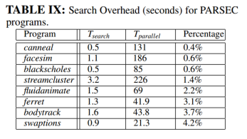

# Thread Reinforcer: Dynamically Determining Number of Threads via OS Level Monitoring--线程强化器:通过操作系统级别监控动态确定线程数

## 解决问题：

分别在4核、8核、24核、64核机器上进行实验，分为线程与核绑定与不绑定两种情况，观察现象得到：

（1）线程数=核数，系统性能得到最大；

（2）核数较少，线程与核绑定，系统性能略微有所提高；

（3）核数较多，线程与核绑定，系统性能下降；

传统的观点认为，多线程应用程序的线程数应该与核心数相匹配。实际在密集型/高锁争用程序在核心数较多情况下，线程与核绑定下比不绑定情况下系统性能有所下降，为了使性能最大化，如何根据当前的系统负载和应用程序行为动态确定多线程应用在多核系统上的最优线程数？线程数较少导致系统资源利用率不足，线程数较多导致锁争用/共享资源降低应用程序性能。

## 提出设想：

传统的方法通常需要手动试验不同的线程数或依赖复杂的编译技术来优化线程使用，无法实时响应系统负载变化，摒弃脱机方式（使用不同线程数量运行应用程序，提供最佳性能的适当线程数，耗时较大且不实际）。

提出“线程强化器”框架--通过动态监控程序的执行，搜索可能产生最佳加速的线程数量，最终确定最佳线程数。

## 限制程序加速原因：

1、User用户模式时间：线程执行应用程序耗费时间，耗时越大说明有效执行任务

2、System系统时间：线程系统调用/文本页面错误等耗时，耗时越大，性能越低

3、锁争用时间：耗时越大，线程阻塞情况频繁，性能低下

4、等待CPU时间：线程数>处理器核心，耗时高CPU饱和，程序加速受限

## 线程强化器框架：

根据实时监控线程指标和可能预设的配置文件动态调整线程数，去适应不同的工作负载，Tmin-Tmax线程范围内搜索尽快确定最佳线程数，最小化运行时开销。

本文采用prstat核mpstat工具采集指标：

1、LOCK(锁争用)

- **用途**：监控线程在等待锁的时间比例。锁争用率高表示线程频繁等待访问共享资源，减缓程序执行速度。
- **调整决策**：如果LOCK值增加，增加线程数可能导致更多的性能瓶颈，减少线程数或优化锁的使用。

2、MIGR_RAT E(线程迁移率)

- **用途**：测量线程在处理器核心间迁移的频率。频繁的迁移可能影响线程的缓存局部性，降低效率。
- **调整决策**：低迁移率表明线程数较为适宜/可适度增加，高迁移率则表明线程过多，需减少线程数减轻核心间的负载转移。

3、VCX_RAT E(自愿上下文切换率)

- **用途**：度量线程自愿让出CPU的频率，通常在等待I/O操作或其他非CPU资源时发生。
- **调整决策**：切换率高线程经常等待外部资源，需调整线程数。

4、CPU_UTIL(处理器利用率)

- **用途**：CPU的整体利用率，衡量系统是否充分使用处理能力。
- **调整决策**：低CPU利用率表明系统有未被充分利用的资源，增加线程数；高利用率则表明CPU资源已饱和，需减少线程数降低系统负担。

检查配置文件当前值、变化速度，这些值在过去两次运行中的指标变化表示为ΔLOCK、ΔMIGR_RATE、ΔVCX_RATE和ΔCPU_UTIL。

### 伪代码：

```c
FindN() {
    Tbest ← Tmin; Nbest ← Convert(Tbest);
    Pbest ← Collect profile for 100 milliseconds run with parameter Nbest .
    Ttry ← Tmin +Tstep; Ntry ← Convert(Ttry);
    Ptry ← Collect profile for 100 milliseconds run with parameter Ntry.
    loop
    if Terminate(Pbest ,Ptry) = true then
    return(Nbest)
    else
    Tbest ← Ttry; Nbest ← Ntry; Pbest ← Ptry
    Ttry ← ComputeNextT(Pbest ,Ptry);
    Ntry ← Convert(Ttry);
    Ptry ← Collect profile for 100 milliseconds run with parameter Ntry.
    endif
    endloop
}

ComputeNextT(Pbest ,Ptry) {
    if Ttry ≤ NumCores then
    if low(Ptry.LOCK) or low(Ptry.ΔVCX_RAT E) or
    (high(Ptry.LOCK) and low(Ptry.ΔLOCK))
    then
    ΔT = Tstep
    else
    ΔT = Tstep/2
    endif
    else – Ttry > NumCores
    if low(Ptry.LOCK) or low(Ptry.ΔMIGR_RAT E) then
    ΔT = Tstep
    else
    ΔT = Tstep/2
    endif
    endif
    return( minimum(Ttry +ΔT,Tmax) )
}

Terminate(Pbest ,Ptry) {
    – terminate if no more parallelism was found
    if low(Ptry.ΔCPU_UTIL) then return(true) endif
    – terminate for high lock contention, VCX rate, and migration rate
    if high(Ptry.LOCK) then
    if high(Ptry.ΔLOCK) or
    Ttry ≤ NumCores and high(Ptry.ΔVCX_RAT E) or
    Ttry > NumCores and high(Ptry.ΔMIGR_RAT E)
    then
    return(true)
    endif
    endif
    – terminate if no more threads can be created
    if Ttry = Tmax then
    Tbest ← Ttry; Nbest ← Ntry; return(true)
    endif
    – otherwise do not terminate
retrun(false)
```

### python版本：

#### FindN():

主函数，负责初始化搜索，迭代寻找最佳线程数。首先设置最小的线程数`Tmin`并收集其性能概况，然后逐步增加线程数，直到找到最佳配置或达到最大线程数Tmax。

- Tmin：最小线程数
- Tbest：当前最优线程数
- Nbest：命令行参数格式的线程数
- 返回结果：命令行参数

```c
def FindN():
    Tbest = Tmin//初始化成最小线程数
    Nbest = Convert(Tbest)//将最佳线程数转换为对应的命令行参数值
    Pbest = CollectProfile(Nbest, 100) //收集当前最佳线程数下的性能概况，持续时间100s

    Ttry = Tmin + Tstep//尝试的下一个线程数
    Ntry = Convert(Ttry)
    Ptry = CollectProfile(Ntry, 100)

    while True://持续循环直到找到最佳线程数
        if Terminate(Pbest, Ptry)://判断是否应当终止搜索
            return Nbest//返回当前认为最佳的线程数是命令行参数
        else:
            Tbest, Nbest, Pbest = Ttry, Ntry, Ptry//更新最佳线程数、最佳线程数的命令行参数、最佳线程数的性能那概况
            Ttry = ComputeNextT(Pbest, Ptry)//计算下一个尝试的线程数
            Ntry = Convert(Ttry)
            Ptry = CollectProfile(Ntry, 100)

```

####  ComputeNextT():

根据最佳性能指标和最新尝试的性能那指标决定线程数的步长

```c
def ComputeNextT(Pbest, Ptry):
    if Ttry <= NumCores://如果尝试的线程数小于等于核心数
        if low(Ptry.LOCK) or low(Ptry.ΔVCX_RATE) or (high(Ptry.LOCK) and low(Ptry.ΔLOCK)):
        //检查锁竞争是否低，锁竞争低说明当前系统中线程间阻塞情况较少
        //检查上下文切换率与上次相比是否低，低则说明线程较少因等待资源（如I/O操作或锁等待）而被挂起。
        //检查锁竞争是否高但与上一次相比变化是否变小，通过提高线程数提高系统性能。
            ΔT = Tstep//实验中设置8，将下一次尝试的线程数增加一个较大的固定步长
        else:
            ΔT = Tstep / 2//一半额外线程
    else://线程数>核数
        if low(Ptry.LOCK) or low(Ptry.ΔMIGR_RATE)://锁竞争低/线程迁移率增量低
            ΔT = Tstep
        else:
            ΔT = Tstep / 2
    return min(Ttry + ΔT, Tmax)//返回增加后的线程数，不超过最大线程数
                
```

#### Terminate()：

决定终止线程数，确保搜索不会无休止进行，减少不必要地资源消耗和时间延迟

```c
def Terminate(Pbest, Ptry):
    if low(Ptry.ΔCPU_UTIL)://Ptry的CPU利用率变化是否较小，可能已找到近似最佳线程数，停止搜索
        return True 
    if high(Ptry.LOCK)://锁竞争是否提高
        if high(Ptry.ΔLOCK) or (Ttry <= NumCores and high(Ptry.ΔVCX_RATE)) or (Ttry > NumCores and high(Ptry.ΔMIGR_RATE)):
		//锁竞争增量较大/线程数<=核心并且上下文切换率变化显著/线程数>核心并且线程迁移率变化显著
            return True//停止
    if Ttry == Tmax://达到最大线程数上限
        Tbest, Nbest = Ttry, Ntry//更新
        return True//停止
    return False//继续
            
```

终止条件:CPU利用率低/锁争用高/上下文切换率高/线程迁移率高/尝试的最佳线程数=最大值Tmax

## 局限：

适合于初始化周期较短的应用程序(即在执行早期观察到工作线程的创建)应用程序初始化时间较长，需要多次重新启动程序测试不同的线程配置，引入额外延迟。

## 预期结果：

测试框架使用的广泛性，将该框架扩展至其他应用程序，导致线程强化器终止条件以及程序运行时开销：




明显看出程序的搜索时间0.5s-3.2s不等，程序并行执行时间21.3s-226s不等，搜素时间占每个程序并行执行时间比例较小0.4%-4.2%，故可知提出的算法框架在程序运行时搜索开销是非常小的，不会影响程序性能，所以低延迟的同时找到最佳线程数，达到系统性能的最优化。