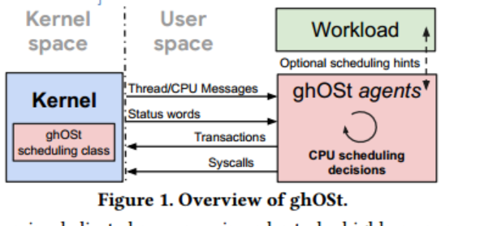
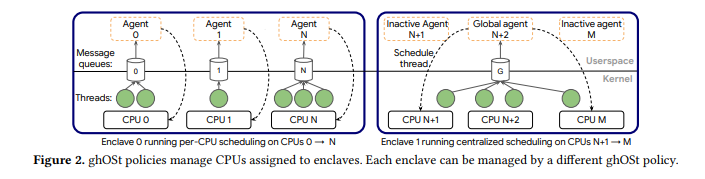
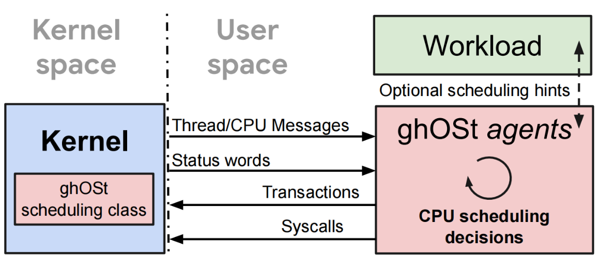
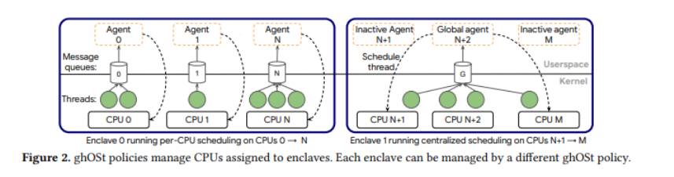

# ghOSt：Linux调度的快速灵活的用户空间委托

## 摘要

ghOSt提供了通用的调度策略并托管给用户空间进程。ghOSt提供状态封装、通信和操作机制，允许在用户空间代理中复杂地表达调度策略，同时协助同步。程序员可以使用任何语言来开发和优化策略，而无需重新启动主机即可修改这些策略。ghOSt支持广泛的调度模型，从单cpu调度到集中式调度，从运行到完成调度到抢占调度，并且调度操作的开销很低。

## ghost存在的意义

### 现存的问题

以前通过设计用户空间解决方案来提高性能和降低内核复杂性的尝试有明显的缺点:

- 需要对应用程序实现进行大量修改
- 为了实现高度相应，需要耗费大量资源
- 需要对内核进行大量修改

### 目标

- 最小化修改内核
- 随着硬件不断提升，我们的调度策略也可以随之改进
- 像gpu和tpu这样的领域特定的加速器，都是新型的紧密耦合计算设备，它们完全存在于经典调度程序的领域之外。

## 设计与实现

### 总体框架

如下图所示。用户空间的agent做出调度决定并且指导kernel如何在CPU上调度操作系统线程。ghOSt将内核调度机制与策略定义解耦。具体如下：ghost的kernel部分被实现为一个调度class。这个调度类向用户空间提供丰富的API来自定义调度策略。为了帮助agents做出调度决定，kernel向agent传递线程状态信息，通过`messages`和`status words`。agents收到信息后通过`transactions`和`syscalls`向kernel传递数据，做出决策。

### 具体实现

整个系统的调度架构如下图所示，ghost可以设置起多个`enclave`(接口模块)，每个enclave中可以运行不同的调度策略。ghost内核模块会将调度的决定逻辑托管给运行在每个物理CPU上的ghost agent。

每个 agent进程都会在内核中产生一个对应的 *enclave* 接口模块，该模块提供了一系列接口，通过该接口可以将内核的信息传递给用户态的agent 。

- 如果该enclave采用per-CPU的调度策略，则ghost内核模块会向各个cpu上的ghost agent分别提供必要的线程信息。

- 如果该enclave采用Centralized的调度策略，则该enclave中仅有一个ghost agent会生效，即global agent，所有的调度信息也仅会提供给它

linux中不同策略类是有优先级的。每个线程调度应该只能依据一个策略。具有高优先级调度策略的线程会比具有低优先级调度策略的进程优先调度。也就是说，进程调度的时候，影响其优先级的有，它的调度策略的优先级，以及它在当前调度策略中的优先级。

#### per-cpu

一个agent对一个逻辑CPU负责，并且**agent也被视为线程**，这也意味着他们可以互相抢占。在其对应逻辑CPU执行，这意味着它会与自己管理的ghost线程进行CPU抢占。

agent差不多是当前cpu中所有线程中优先级最高的，这是为了当消息队列中有消息的时候，也就是需要进行调度决策时能够让agent迅速抢占CPU，快速做出决策。

当agent做出调度决策后，它会进行上下文切换，切换到下一个要被执行的线程

#### centralized model

存在一个global agent和多个incative agent。global agent对多个逻辑CPU负责。global agent**采用不间断轮询调度**。与per-CPU相同，global agent也被置为最高优先级，从而确保它始终独占一个CPU，禁止其他ghost线程对其进行抢占。

#### kernel与agent通信

每个agent都管理一条消息队列。也就是per-cpu的每个逻辑cpu都有一个消息队列，集中式的一个global agent有一个消息队列。也就是说一个agent有一个消息队列。前面提到过，agent是一个线程，因此有睡眠态。对于per-cpu来说，当消息队列不为空的时候，则需要唤醒agent，但对于集中式来说，对于centralized model，消息队列一直被不断轮询，其中global agent指向当前的消息队列

#### agent与kernel通信

1.使用事务提交调度策略，允许group commit

2.使用seq num保证通信同步

seq num被kernel（具体逻辑应该由ghost调度类实现）通过shared memory以status words的形式来与agent进行共享

- per-CPU 采用Aseq同步
  - 为什么要同步：agent想要立刻接收到消息队列的信息的话，必须处于sleep状态，这样它才能被信息wakeup。如果当agent正在run，它就无法接收到最新消息。只有在当他做出调度决策之后，将当前CPU所有权转让给下一个需要被调度的线程之后，再次进入沉睡，才能再次被唤醒，从而得到最新消息，但这太晚了。To address this，我们引入了seq num。
  - 如何实现同步：①Read Aseq ②读取msq ③决定调度策略 ④commit。若commit的最新Aseq比内核观测到的最新Aseq小，那么commit失败

2.centralized 采用Tseq同步

意思说有一个thread的seq不一致，该次事务的group commit全部无效。

3.使用ebpf加速

当CPU变得空闲而代理尚未发出事务时，BPF程序会发出自己的事务，选择一个在该CPU上运行的线程。这是利用了ebpf的即时性。这部分改动其实也不是不能在agent做或者多弄一个线程做，ebpf胜就胜在其方便高效。

ebpf实现的点

- 挂载在进程状态change的那个点，在那个点进行进程状态信息的提交以及对seq num的递增
- 挂载在TXNS_COMMIT这个syscall执行的点，控制进行上下文的切换
  - 代理使用TXN_CREATE()辅助函数在共享内存中打开一个新事务。代理既写入要调度的线程的TID，也写入要调度线程的CPU ID。
  - 填充事务后，代理通过TXNS_COMMIT()系统调用将其提交给内核，该系统调用启动提交过程并触发内核启动上下文切换

## 小结

ghOSt将“做出一个调度决策”这个过程分成了三个主体来实现，如下图所示。

三个主体分别为Kernel、ghOSt agent和WorkLoad

- Kernel端

  即为添加了ghOSt运行所需补丁的Linux内核。ghOSt在内核中新增了调度类Ghost，用于：

  1. 接收并执行来自userspace的调度决策，将进程调度到指定CPU上
  2. 将进程相关信息传递到userspace，以帮助其做出调度决策

- ghOSt agent端

  Agent由程序员负责编写代码。

  它是调度算法（如FIFO等）的具体实现，负责管理调度WorkLoad端创建的线程，做出调度决策，并将调度决策传入内核。它还可以接收来自内核的信息，并将其中WorkLoad关心的部分告知WorkLoad。

- WorkLoad端

  WorkLoad为具体的多线程应用场景。它产生的线程交给Agent进行调度。它可能会从Agent处接收来自内核的信息，从而动态调整负载的工作逻辑；它也可能会更新线程的某些信息（例如状态、优先级等），从而动态地影响Agent做出调度策略。

## 举例

在以下情况下，有一个进程进来如何被ghost调度。

### per-cpu model

在per-cpu情况下，每个核心有一个代理线程。每个代理负责在该核心上的调度，并负责维护运行队列、任务状态等信息。当内核中有一个新的进程要被调度，内核会生成一条这个进程创建的消息，这个消息会通过消息队列传到用户空间的agent。同时，再把此进程映射到要添加的队列上，建立消息源和消息队列的关系，再确定在将消息添加到队列中时唤醒哪个代理，建立队列和代理的映射关系。再由对应的代理agent根据消息来执行调度决策。执行完毕之后，代理通过事务将其调度决策提交给内核。

### centralized model

在centralized情况下，多个核心共享一个代理线程。负责调度系统中所有的cpu。存在一个global agent和多个incative agent。global agent一直轮询，incative agent一直睡眠。其中global agent是真正负责系统的调度的代理，并负责维护一个运行队列、进程状态等信息。

当内核中有一个新的进程要被调度，内核会生成一条这个进程创建的消息，并会生成一个序列号，序列号是递增的，包含在这条消息中，首先把此进程映射到要添加的队列上，也就是建立消息源和global agent维护的消息队列的关系，再由global agent根据消息队列中的消息来为所有cpu执行调度决策。执行完毕之后，global agent为线程𝑇提交事务时，写入要调度的线程的TID和调度线程的CPU ID。它会发送事务以及它所知道的𝑇的最新序列号:𝑇𝑠𝑒𝑞（MT，TSeq）给内核。当内核接收到事务时，它验证𝑇𝑠𝑒𝑞相对于事务中的线程是否是最新的。如果是最新的则成功调度。否则，这一组事务的提交都无效。

## 论文中获取的思路

### 优化指标思路

针对特定工作负载类型定制策略可以大大改善关键指标，如延迟、吞吐量、硬/软实时特性、能源效率、缓存干扰和安全性。这块有几个根据特定的工作负载来设计调度算法的例子

- Shinjuku请求调度器优化了高度分散的工作负载，即混合了短请求和长请求的工作负载。从而将请求尾部延迟和吞吐量提高了一个数量级
- 用于虚拟机工作负载的Tableau调度器表明，在多租户场景下，吞吐量提高了1.6倍，延迟提高了17倍
- Caladan调度程序专注于前台低延迟应用程序和后台最佳努力应用程序之间的资源干扰，将网络请求尾部延迟提高了11,000倍

### 测试思路

通过对𝜇s-scale工作负载实施集中式和抢占式的策略来评估ghOSt

- 测试时间开销
- 与别的调度框架进行比对效果
- 在特定应用场景下，针对当前环境中的负载的效果