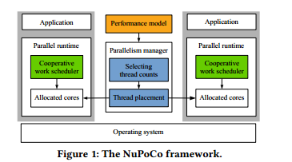
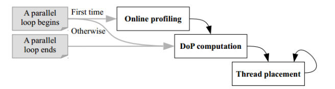
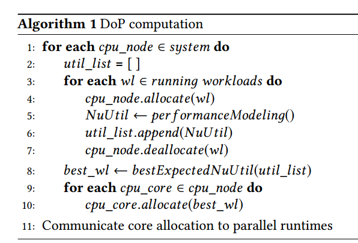
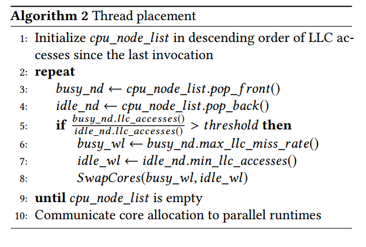
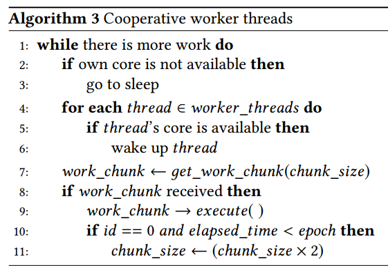

# 通过并行性管理应用程序以实现系统利用率最大化

## 一、解决的现有问题

在现代多核平台中，并行应用程序经常共享计算和内存资源。在这些平台上运行的并行工作负载由并行应用程序运行时  ( 如OpenMP和Intel TBB ) 管理。通常，这样的工作负载是用可配置的线程数来执行的。这项工作的重点在于管理并行应用程序的并行性，以充分利用系统资源，提高 CPU 的利用率。

## 二、现有方法及缺点：

现有的工作通常会为计算密集型应用程序分配更多的工作线程。这可能导致内存系统利用率不足，从而在计算密集型应用程序完成后导致低效的执行其他非密集型应用程序。当然，也有一些运行时系统基于机器学习模型管理应用程序并行性。虽然这些方法也可以对不同的优化目标做出反应，但它们的性能取决于训练数据的质量和数量。

## 三、本文提出的方法

文中提出了 NuPoCo，一个并行管理框架，用于 NUMA 多插槽多核系统上的共定位并行工作负载。NuPoCo 通过考虑 CPU 内核和内存控制器的利用率来为每个共存的应用程序确定适当的线程数，从而最大限度地提高了整体系统利用率。这种动态调度方法，采用每个核心只允许一个活动线程的方法，以减少线程过度订阅引起的性能干扰。

NuPoCo有三个核心组件是：①性能模型，②并行管理器，③并行运行时系统的协作工作调度器。其中性能模型预测了CPU内核和内存控制器对共存并行应用程序的利用率。并行管理器通过利用性能模型和监控硬件性能计数器，定期执行核心分配(即决定每个应用程序的线程数量及其位置)。最后，协作工作调度器根据并行管理器指定的核心分配动态调整其执行==

可以看出 NuPoCo 实现有三个步骤，第一，预测利用率，第二，确定线程数量，第三，分配线程

### 3.1 预测利用率

文中提供了一个解决方案，预测资源利用率基于一个排队系统，该系统对多套接字多核系统上的内存访问进行建模，其中 CPU 内核被视为排队客户，内存控制器被视为排队服务器。排队模型要求来自客户的请求遵循指数分布，并假设内存请求是阻塞的，即，发出请求的核心被阻塞，并且在内存控制器以先进先出的顺序为请求提供服务，在这之前不会生成任何新请求。

性能模型利用了 AMD 和英特尔平台上的标准硬件性能计数器，基于性能预测，并行管理器确定分配给各个共存应用程序的线程数量，并定期重新访问线程的位置。协作工作调度是在 GNU OpenMP 运行时的动态循环调度程序中实现的，它允许应用程序在运行时对工作线程数量的变化做出反应

### 3.2 确定线程数量

现有的方法：

- 根据可用的缓存大小管理应用程序的工作集大小(和线程数)
- 应用机器学习模型来计算分配给应用程序的线程数
- 执行爬山算法以达到最佳线程数

### 3.2 分配线程

NuPoCo 通过控制共定位应用程序在执行 fork-join 式并行部分 （如 OpenMP 或 Intel TBB）工作负载中的并行构造)期间的并行度（Dop）来最大限度地提高系统利用率。DoP 是使用允许动态调整每个并行段的线程数的可伸缩性工作负载来控制的。对于不可延展性的工作负载，可以将并行段的线程固定到指定的硬件内核

## 四、管理并行性

### 4.1 并行管理器的执行过程

NuPoCo 的并行管理器在并行循环开始或结束时被激活。它执行以下三个步骤:在线分析、DoP 计算和线程放置

在在线分析期间，系统的所有核心在短时间内被分配到新的并行部分。在 Dop 计算中，通过为运行并行应用程序分配适当的线程数来最大化系统利用率。在这通过下面的算法来确定每个应用程序的负载，并且分配 CPU 节点，以期产生最佳的总体系统利用率 NuUtil。系统利用率 NuUtil 的预测是基于第4节中的性能预测模型。

DoP  计算将一个CPU节点的所有核心资源，即共享相同 LLC 的核心分配给一个应用程序。算法1结束后，每隔50ms周期性地调用该算法。它反复检索自上次迭代以来 LLC 访问次数最高`busy_nd`和最低 `idle_nd`的 CPU 节点。如果 LLC 访问的比率超过给定的阈值，我们根据在线分析期间推断的信息，从`busy_nd`中选择 LLC 缺失率最高的工作负载，从`idle_node`中选择 LLC 访问次数最少的工作负载。然后，算法交换两个应用程序的多个内核的位置  ( NuPoCo 默认交换两个内核)。这个过程不断重复，直到列表为空。尽管这种线程放置技术是一种爬坡方法，但它很快达到了一个稳定的状态，这一过程算法如下：

### 4.2 协作工作调度器

我们在 GNU OpenMP 运行时中实现了动态空间调度，增加了一个新的循环调度方法，称为协作。 NuPoCo并行管理器通过拦截启动或终止并行循环来跟踪 OpenMP 应用程序的执行。内核分配的结果通过共享内存传递给 OpenMP 并行运行时。运行时通过调整工作线程的数量并将它们固定在指定的内核上，动态地改变协作并行循环的 DoP。

算法3展示了协作调度程序如何执行工作线程。在请求新工作之前，每个线程检查其核心的可用性。如果内核不再可用，线程将进入睡眠状态。活动的工作线程检查当前的内核分配并唤醒内核已经可用的线程。每个线程通过调用第7行上的 `get_work_chunk` 函数来获取一个工作块。为了减少调度开销，主线程根据工作块的执行时间动态调整工作块大小。

## 五 、结论

评估表明，与Linux分时模型和现有的并行管理策略相比，NuPoCo 框架以显著缩短的总周转时间执行多个 OpenMP 并行应用程序，从而最大限度地提高了CPU利用率。
