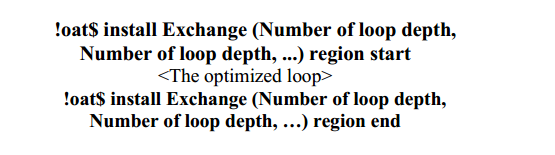
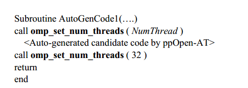

# 通过使用ppOpen-AT改变OpenMP中的指令和线程数进行自动调优

## 摘要

通过应用自动调优(AT)，可以减少调优工作，应用方便。在这项研究中，我们提出了一种使用开放多处理(OpenMP)的程序的AT技术。我们提出了一种使用AT语言改变OpenMP优化循环并根据计算内核动态改变OpenMP线程数的AT方法

**关键词**: 自动调谐;循环转换;动态线程优化;ppOpen-AT;

## AT技术

软件自动调优(Software autotuning, AT)[1]是一种代码优化技术，可以自动对程序进行性能调优。通过使用该技术，可以在不同环境下使用相同的程序实现高性能。还可以提高软件的性能可移植性。

## 本文提出了

在本研究中，我们提出并评价了以下三个内容:

- 提出了一个AT语言的OpenMP指令的AT函数。
- 提出一个AT函数来动态改变OpenMP线程的数量。
- 评估1和2的效率。

## 本文的自动测试软件框架和自动测试语言

1.FIBER (framework of installation, before execution, and runtime optimization layers)是一种用于数值计算软件的AT框架。该框架是一种软件配置方法，可以在以下三个时间点(层)执行AT。

- 安装:在安装库时优化层次结构。
- 执行前:优化层次结构，其参数(问题大小、用于消息传递接口(MPI)的进程数和OpenMP线程数)已由用户确定。
- 运行时:执行库时的优化层次结构

FIBER支持以下两个功能

- 通过使用专用语言向用户程序发出指令，生成执行AT、参数化代码和注册参数的代码的函数。
- 每个层次的参数优化。

2.ppOpen-AT

ppOpen-AT是作为面向下一代科技应用开发的AT机制而开发的一种AT语言。其执行环境为ppOpen-HPC。旨在提高并行数值计算库的开发效率。ppOpen-AT使用FIBER将AT函数添加到程序中

## 一个新的AT函数:使用openmp优化循环更改

我们提出了一个AT函数用于循环转换，以改变目标并行化循环。这可以作为ppOpen-AT的一个新功能来实现。我们的目标是由OpenMP并行化的多个嵌套循环。

ppOpen-AT为优化循环创建的新指令，使用region start - region end来指定AT区域。

用户使用上述参数`Number of loop depth`为ppOpen-AT创建的`Exchange`结构指定OpenMP优化循环。优化后的循环中只接受OpenMP的一个指令

## openmp中一个新的AT函数:动态线程改变

在使用ppOpen-AT的AT中，软件开发人员可以设置性能参数。在ppOpen-AT发布带有AT功能的软件后，通过测量在安装时或执行前执行AT时每个调优候选项的执行时间来改变性能参数的值。执行程序时引用性能参数值的AT结果。

我们可以使用ppOpen-AT实现基于传统AT框架的新功能，但需要动态更改OpenMP线程的数量。为了完成这个修改，OpenMP的应用程序编程接口(API)命名为omp_set_num_threads,可用于更改OpenMP中的线程数。

- 用户设置：用户设置问题大小、MPI进程数量和OpenMP线程的最大数量。
- AT执行：执行AT以更改所有候选线程的数量。对每个进程的有效参数执行AT函数，这个执行时间点在FIBER的执行前。然后为每个进程找到最佳的OpenMP线程数
- 大规模执行：
  - 调用目标例程
  - 使用过程2确定OpenMP线程的最佳数量
  - 使用步骤2确定参数的最佳值
  - 使用最佳线程数和最佳性能参数值执行目标函数

在ppOpen-AT生成的代码中，每个调优候选都由一个子例程组成。因此，很容易在生成的子例程中更改OpenMP线程的数量。例如，我们最多使用32个线程。我们可以将线程号更改为NumThread，生成的代码将通过使用omp_set_num_threads自动更改线程号

## 效果

通过改变线程数，与使用常规方法(不改变线程数)的原始循环相比，执行时间提高了1.003倍。

## 相关工作

ADAPT[17]提出了一种循环转换框架，将多个分裂融合到目标计算核。

ppOpen-AT也提供了循环折叠和循环分割作为AT函数

这项工作的主要贡献是一个新的AT函数，它可以动态地改变线程数，并由AT系统自动转换循环。它也很容易在ppOpen-AT中使用OpenMP API作为AT函数实现。

## 结论

在本研究中，为了实现数值计算软件的高性能，我们提出了两个新的AT函数，用于不同的计算机体系结构。AT函数目前不是ppOpen-AT中实现的函数。

第一个AT函数是一个循环转换，它改变OpenMP中优化的循环(指令的位置)。可以使用ppOpen-AT将此更改用于循环转换，例如循环折叠。

第二个AT函数是OpenMP线程数量的动态变化。常规执行使用固定数量的线程。通过调整新的AT函数，在运行时更改每个优化循环中的线程数。在执行每个优化循环之后，将线程数设置为最终用户指定的最大线程数